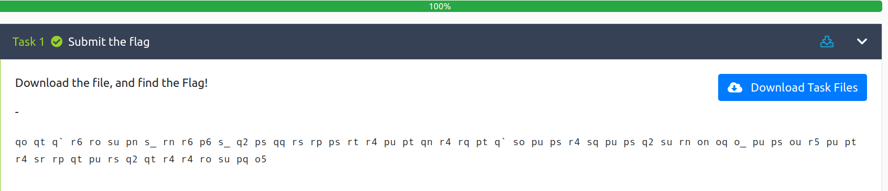
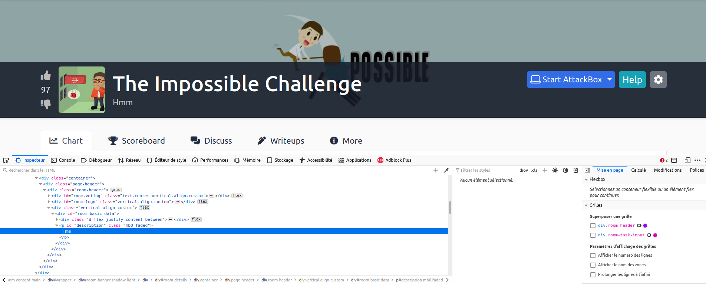
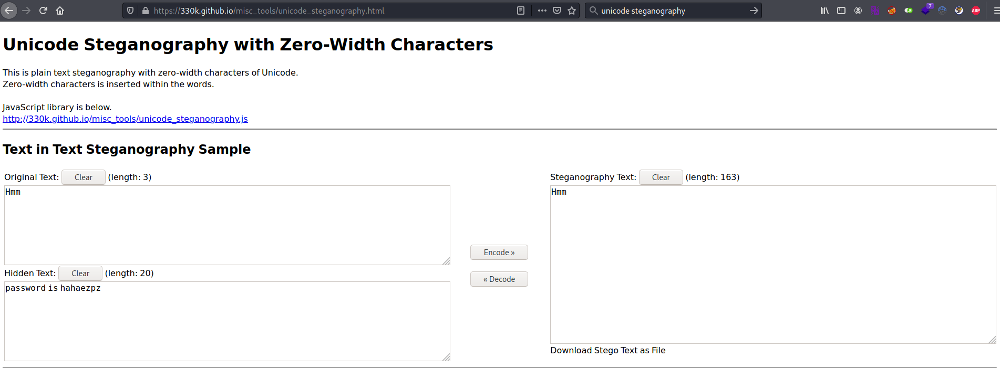

# The Impossible Challenge #

   

Sur la page de l'exercise on voit une chaîne codée.  

```bash
tim@kali:~/Bureau/tryhackme/write-up$ echo 'qo qt q` r6 ro su pn s_ rn r6 p6 s_ q2 ps qq rs rp ps rt r4 pu pt qn r4 rq pt q` so pu ps r4 sq pu ps q2 su rn on oq o_ pu ps ou r5 pu pt r4 sr rp qt pu rs q2 qt r4 r4 ro su pq o5' | tr n-za-mN-ZA-M a-zA-Z
db dg d` e6 eb fh ca f_ ea e6 c6 f_ d2 cf dd ef ec cf eg e4 ch cg da e4 ed cg d` fb ch cf e4 fd ch cf d2 fh ea ba bd b_ ch cf bh e5 ch cg e4 fe ec dg ch ef d2 dg e4 e4 eb fh cd b5

tim@kali:~/Bureau/tryhackme/write-up$  echo 'db dg d` e6 eb fh ca f_ ea e6 c6 f_ d2 cf dd ef ec cf eg e4 ch cg da e4 ed cg d` fb ch cf e4 fd ch cf d2 fh ea ba bd b_ ch cf bh e5 ch cg e4 fe ec dg ch ef d2 dg e4 e4 eb fh cd b5'| tr '!-~' 'P-~!-O'
53 58 51 6e 63 79 42 70 62 6e 4e 70 5a 47 55 67 64 47 68 6c 49 48 52 6c 65 48 51 73 49 47 6c 75 49 47 5a 79 62 32 35 30 49 47 39 6d 49 48 6c 76 64 58 49 67 5a 58 6c 6c 63 79 45 3d

tim@kali:~/Bureau/tryhackme/write-up$ echo '53 58 51 6e 63 79 42 70 62 6e 4e 70 5a 47 55 67 64 47 68 6c 49 48 52 6c 65 48 51 73 49 47 6c 75 49 47 5a 79 62 32 35 30 49 47 39 6d 49 48 6c 76 64 58 49 67 5a 58 6c 6c 63 79 45 3d' | hex2raw | base64 -d
It's inside the text, in front of your eyes!
```

On décode le message :
ROT 13 -\> ROT47 -\> hexadécimal -\> base64.    

On a un message qui nous dit : C'est à l'intérieur du texte, devant tes yeux.   

```bash
tim@kali:~/Bureau/tryhackme/write-up$ file Impossible.zip 
Impossible.zip: Zip archive data, at least v2.0 to extract
tim@kali:~/Bureau/tryhackme/write-up$ unzip Impossible.zip 
Archive:  Impossible.zip
[Impossible.zip] flag.txt password:
```

Le fichier zip téléchargé à besoin d'un mot de passe.   

   

Dans le titre on remarque hmm

Dans le mode développeur dans Inspecteur une remarque la chaîne Hmm on la copie. 

   

On va sur un site qui permet de décoder la stéganographie unicode, quand on copie notre texte on voit qu'elle fait 163 de longueur, il y a bien des caractères que ne voyaient pas.   

On la décode et on trouve notre mot de passe qui est : hahaezpz   

**flag is in the format THM{}** 

```bach
tim@kali:~/Bureau/tryhackme/write-up$ unzip Impossible.zip 
Archive:  Impossible.zip
[Impossible.zip] flag.txt password: 
  inflating: flag.txt                
tim@kali:~/Bureau/tryhackme/write-up$ cat flag.txt 
You have solved the Impossible Challenge! Here is your flag THM{Zero_Width_Characters_EZPZ}
```

On décompresse l'archive avec le mot de passe.  
On regarde le fichier flag.txt.  

La réponse est : THM{Zero_Width_Characters_EZPZ}     