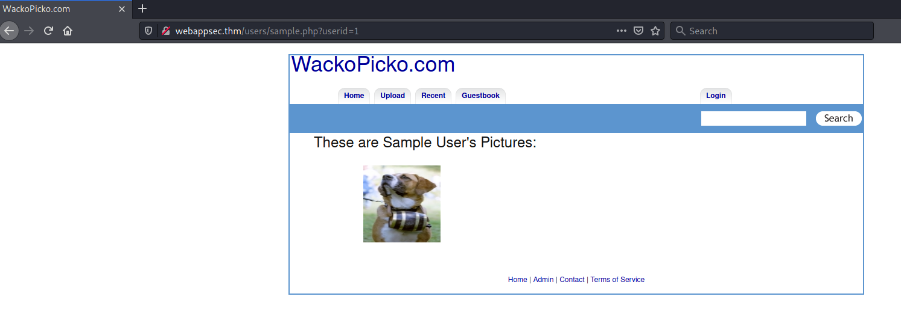

# WebAppSec 101 #

## Task 1 Basic Description & Objectives  ##

**Connect to the network using openvpn and deploy the machine**

Vous cliquez sur start machine.     

## Task 2 Walking through the application ##

```bash
tim@kali:~/Bureau/tryhackme/write-up$ sudo sh -c "echo '10.10.74.215 webappsec.thm' >> /etc/hosts"

tim@kali:~/Bureau/tryhackme/write-up$ sudo nmap -A webappsec.thm -p-
Starting Nmap 7.91 ( https://nmap.org ) at 2021-08-18 10:22 CEST
Nmap scan report for webappsec.thm (10.10.74.215)
Host is up (0.034s latency).
rDNS record for 10.10.74.215: wenappsec.thm
Not shown: 65531 closed ports
PORT      STATE SERVICE VERSION
22/tcp    open  ssh     OpenSSH 7.4 (protocol 2.0)
| ssh-hostkey: 
|   2048 6f:6b:35:0d:a8:cf:e2:e5:55:ce:42:bd:a0:b7:91:0f (RSA)
|   256 93:26:0d:80:bc:3b:fd:ef:11:d3:93:b3:36:68:67:08 (ECDSA)
|_  256 e1:b7:4d:5c:1c:61:87:b7:65:5c:1d:a7:5d:7e:1b:06 (ED25519)
80/tcp    open  http    Apache httpd 2.4.7 ((Ubuntu))
| http-cookie-flags: 
|   /: 
|     PHPSESSID: 
|_      httponly flag not set
|_http-server-header: Apache/2.4.7 (Ubuntu)
|_http-title: WackoPicko.com
111/tcp   open  rpcbind 2-4 (RPC #100000)
| rpcinfo: 
|   program version    port/proto  service
|   100000  2,3,4        111/tcp   rpcbind
|   100000  2,3,4        111/udp   rpcbind
|   100000  3,4          111/tcp6  rpcbind
|   100000  3,4          111/udp6  rpcbind
|   100024  1          36227/udp   status
|   100024  1          49395/tcp6  status
|   100024  1          50968/udp6  status
|_  100024  1          53463/tcp   status
53463/tcp open  status  1 (RPC #100024)
No exact OS matches for host (If you know what OS is running on it, see https://nmap.org/submit/ ).
TCP/IP fingerprint:
OS:SCAN(V=7.91%E=4%D=8/18%OT=22%CT=1%CU=33627%PV=Y%DS=2%DC=T%G=Y%TM=611CC36
OS:7%P=x86_64-pc-linux-gnu)SEQ(SP=101%GCD=1%ISR=10C%TI=Z%CI=Z%II=I%TS=A)OPS
OS:(O1=M506ST11NW6%O2=M506ST11NW6%O3=M506NNT11NW6%O4=M506ST11NW6%O5=M506ST1
OS:1NW6%O6=M506ST11)WIN(W1=68DF%W2=68DF%W3=68DF%W4=68DF%W5=68DF%W6=68DF)ECN
OS:(R=Y%DF=Y%T=FF%W=6903%O=M506NNSNW6%CC=Y%Q=)T1(R=Y%DF=Y%T=FF%S=O%A=S+%F=A
OS:S%RD=0%Q=)T2(R=N)T3(R=N)T4(R=Y%DF=Y%T=FF%W=0%S=A%A=Z%F=R%O=%RD=0%Q=)T5(R
OS:=Y%DF=Y%T=FF%W=0%S=Z%A=S+%F=AR%O=%RD=0%Q=)T6(R=Y%DF=Y%T=FF%W=0%S=A%A=Z%F
OS:=R%O=%RD=0%Q=)T7(R=Y%DF=Y%T=FF%W=0%S=Z%A=S+%F=AR%O=%RD=0%Q=)U1(R=Y%DF=N%
OS:T=FF%IPL=164%UN=0%RIPL=G%RID=G%RIPCK=G%RUCK=G%RUD=G)IE(R=Y%DFI=N%T=FF%CD
OS:=S)

Network Distance: 2 hops

TRACEROUTE (using port 554/tcp)
HOP RTT      ADDRESS
1   32.73 ms 10.9.0.1
2   32.91 ms wenappsec.thm (10.10.74.215)

OS and Service detection performed. Please report any incorrect results at https://nmap.org/submit/ .
Nmap done: 1 IP address (1 host up) scanned in 48.51 seconds

```
**What version of Apache is being used?**

D'après le scan de nmap la version d'Apache est : 2.4.7   

La réponse est : 2.4.7

**What language was used to create the website?**

   

On que l'extension de index est php.   

La réponse est : PHP     

**What version of this language is used?**

```bash
tim@kali:~/Bureau/tryhackme/write-up$ curl -v http://webappsec.thm -s | header -20
*   Trying 10.10.74.215:80...
* Connected to webappsec.thm (10.10.74.215) port 80 (#0)
> GET / HTTP/1.1
> Host: webappsec.thm
> User-Agent: curl/7.74.0
> Accept: */*
> 
header: command not found
* Mark bundle as not supporting multiuse
< HTTP/1.1 200 OK
< Date: Wed, 18 Aug 2021 08:36:41 GMT
< Server: Apache/2.4.7 (Ubuntu)
< X-Powered-By: PHP/5.5.9-1ubuntu4.24
< Set-Cookie: PHPSESSID=erb1cv7a193dhn7g2q9vgpl1m6; path=/
< Expires: Thu, 19 Nov 1981 08:52:00 GMT
< Cache-Control: no-store, no-cache, must-revalidate, post-check=0, pre-check=0
< Pragma: no-cache
< Vary: Accept-Encoding
< Content-Length: 3246
< Content-Type: text/html
< 
{ [3246 bytes data]
* Connection #0 to host webappsec.thm left intact
```

Dans le header de la page principale on voit que la version de PHP est 5.5.9  

La réponse est : 5.5.9     

## Task 4 Authentication ##

**What is the admin username?**

Réponse : admin  

On devine non d'utilisateur admin.   

**What is the admin password?**

Réponse : admin

On devine aussi le mot de passe.   

**What is the name of the cookie that can be manipulated?**

   

On voit qu'il y a deux cookies.
Celui que l'on peut manipuler est : session

La réponse est : session.   

**What is the username of a logged on user?**

   

On va sur le lien : Check out a sample user!

   

On voit que l'on peut modifier le nombre dans userid

 

On modifiant les nombres on trouve plusieurs noms.   

Le bon nom est :  bryce 

La réponse est : bryce 

**What is the corresponding password to the username?**

C'est la même faiblesse que avec admin, le mot de passe pour bryce est bryce.   

Réponse : bryce.  

## Task 5 Cross Site Scripting (XSS) ##

**Test for XSS on the search bar**

Dans la bar de recherche on tape du javascript :     
```text
<script>alert('salut')</script>   
```

   

On voit que le script fonctionne, le site est vulnérable à la faille XSS.    

**Test for XSS on the guestbook page**


 

On voit script reste dans le livre d'or on une faille XSS persistante.    

**Test for XSS behind the flash form on the home page**

 

Dans la section ou on téléverse le fichier est aussi vulnérable a la faille XSS.     

## injection xss ##

**Perform command injection on the check password field**
**Check for SQLi on the application**

 


On injecte l'exploit et on trouve tout les noms.  


## ask 7 Miscellaneous & Logic Flaws ##

**Find a parameter manipulation vulnerability**

Nous l'avons trouver avant c'était userid.   

**Find a parameter manipulation vulnerability**

```bash
tim@kali:~/Bureau/tryhackme/write-up$ echo "<?php echo '<p>Hello World</p>'; ?>" > test.php
```

Dans \/pictures\/upload.php  
   
  

Il est possible d'injecter n'import quel fichier php, même un reverse shell.    

